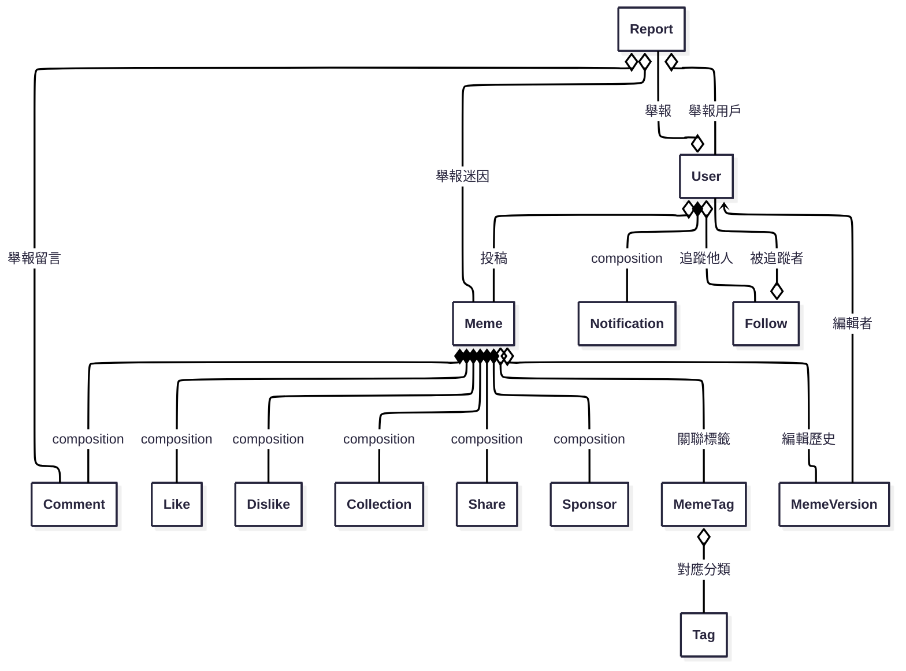

# memedam_backend

## 📋 專案概述

迷因典後端系統是一個完整的迷因分享平台，提供用戶註冊、迷因管理、社交互動、推薦系統等全方位功能。系統採用 Node.js + Express + MongoDB 架構，整合了多種推薦演算法和社交功能。

### 🎯 核心特色

- **混合推薦系統**: 結合協同過濾、內容基礎、熱門分數、社交協同過濾
- **社交功能**: 追隨系統、社交影響力計算、社交層推薦
- **完整互動**: 按讚、留言、收藏、分享、瀏覽統計
- **智能搜尋**: Fuse.js 模糊搜尋、標籤篩選
- **資料一致性**: MongoDB 事務處理、自動統計維護
- **效能優化**: Redis 快取、資料庫索引優化、非同步處理
- **安全防護**: 完整的限流保護、安全中間件、防暴力攻擊

### 🏗️ 技術架構

- **後端框架**: Node.js + Express
- **資料庫**: MongoDB + Mongoose
- **快取系統**: Redis
- **檔案上傳**: Cloudinary
- **認證系統**: JWT + Passport.js (OAuth 社群登入)
- **搜尋引擎**: Fuse.js
- **推薦演算法**: 自研混合推薦系統
- **安全保護**: Helmet + HPP + Rate Limiting
- **監控系統**: 結構化日誌 + 效能監控

### 📊 系統統計

- **API 端點**: 120+ 個 RESTful API
- **資料模型**: 18 個 Mongoose 模型
- **推薦演算法**: 5 種演算法整合
- **社交功能**: 完整的追隨和影響力系統
- **監控系統**: 完整的效能監控和 A/B 測試
- **安全防護**: 多層級限流和安全保護

## 🔧 環境配置

### 環境變數設定

創建 `.env` 檔案並設定以下環境變數：

```bash
# 資料庫配置
MONGO_URI=mongodb://localhost:27017/memedam
REDIS_URL=redis://localhost:6379

# 應用配置
PORT=4000
NODE_ENV=development

# JWT 配置
JWT_SECRET=your_jwt_secret_here
JWT_EXPIRES_IN=7d

# 雲端存儲配置
CLOUDINARY_CLOUD_NAME=your_cloudinary_cloud_name
CLOUDINARY_API_KEY=your_cloudinary_api_key
CLOUDINARY_API_SECRET=your_cloudinary_api_secret

# 社交登入配置
GOOGLE_CLIENT_ID=your_google_client_id
GOOGLE_CLIENT_SECRET=your_google_client_secret
FACEBOOK_APP_ID=your_facebook_app_id
FACEBOOK_APP_SECRET=your_facebook_app_secret
DISCORD_CLIENT_ID=your_discord_client_id
DISCORD_CLIENT_SECRET=your_discord_client_secret
TWITTER_CLIENT_ID=your_twitter_client_id
TWITTER_CLIENT_SECRET=your_twitter_client_secret

# 電子郵件服務 (SendGrid)
SENDGRID_API_KEY=your_sendgrid_api_key
FROM_EMAIL=noreply@memedam.com

# 前端URL配置（重要！）
# 開發環境：http://localhost:5173
# 生產環境：https://memedam.com
FRONTEND_URL=http://localhost:5173

# API基礎URL配置（重要！）
# 開發環境：http://localhost:4000
# 生產環境：https://api.memedam.com
API_BASE_URL=http://localhost:4000

# 其他配置
CORS_ORIGIN=http://localhost:5173
```

### 前端URL配置說明

通知服務會根據 `FRONTEND_URL` 環境變數來生成正確的跳轉連結：

- **開發環境**: `http://localhost:5173`
- **測試環境**: `http://localhost:5173`
- **生產環境**: `https://memedam.com`

如果不設定 `FRONTEND_URL`，系統會根據 `NODE_ENV` 自動判斷：

- `development` 或 `test`: 使用 `http://localhost:5173`
- `production`: 使用 `https://memedam.com`

## 📊 API 路由功能對照表

### 🔐 認證權限說明

- 🔓 **公開** - 無需認證
- 🔑 **用戶** - 需要登入認證 (`token` + `isUser`)
- 👑 **管理員** - 需要管理員權限 (`token` + `isAdmin`)
- 🛡️ **經理** - 需要經理權限 (`token` + `isManager`)

---

### 👤 用戶管理 (`/users`)

| 方法   | 端點         | 功能         | 權限 | 統計維護    |
| ------ | ------------ | ------------ | ---- | ----------- |
| POST   | `/users`     | 用戶註冊     | 🔓   | -           |
| GET    | `/users`     | 獲取所有用戶 | 🛡️   | -           |
| GET    | `/users/me`  | 獲取個人資訊 | 🔑   | -           |
| PUT    | `/users/me`  | 更新個人資訊 | 🔑   | -           |
| DELETE | `/users/me`  | 刪除個人帳號 | 🔑   | ✅ 所有統計 |
| GET    | `/users/:id` | 獲取指定用戶 | 🔓   | -           |
| PUT    | `/users/:id` | 更新指定用戶 | 🛡️   | -           |
| DELETE | `/users/:id` | 刪除指定用戶 | 🛡️   | ✅ 所有統計 |

#### 認證相關

| 方法 | 端點                    | 功能         | 權限 |
| ---- | ----------------------- | ------------ | ---- |
| POST | `/users/login`          | 本地登入     | 🔓   |
| POST | `/users/logout`         | 登出         | 🔑   |
| POST | `/users/refresh`        | 刷新 Token   | 🔑   |
| POST | `/users/bind/:provider` | 綁定社群帳號 | 🔑   |

#### OAuth 社群登入 (完整實作)

| 方法 | 端點                   | 功能           |
| ---- | ---------------------- | -------------- |
| GET  | `/users/auth/google`   | Google OAuth   |
| GET  | `/users/auth/facebook` | Facebook OAuth |
| GET  | `/users/auth/discord`  | Discord OAuth  |
| GET  | `/users/auth/twitter`  | Twitter OAuth  |

#### OAuth 社群帳號綁定 (完整實作)

| 方法 | 端點                                  | 功能                  |
| ---- | ------------------------------------- | --------------------- |
| GET  | `/users/bind-status`                  | 獲取綁定狀態          |
| GET  | `/users/bind-auth/:provider`          | 初始化 OAuth 綁定流程 |
| GET  | `/users/bind-auth/:provider/init`     | OAuth 授權初始化      |
| GET  | `/users/bind-auth/:provider/callback` | OAuth 綁定回調        |

---

### 🎭 迷因管理 (`/memes`)

| 方法   | 端點                        | 功能         | 權限 | 統計維護                |
| ------ | --------------------------- | ------------ | ---- | ----------------------- |
| POST   | `/memes`                    | 創建迷因     | 🔑   | ✅ 作者 `meme_count +1` |
| GET    | `/memes`                    | 獲取迷因列表 | 🔓   | -                       |
| GET    | `/memes/search-suggestions` | 搜尋建議     | 🔓   | -                       |
| GET    | `/memes/by-tags`            | 標籤篩選     | 🔓   | -                       |
| GET    | `/memes/:id`                | 獲取單一迷因 | 🔓   | -                       |
| PUT    | `/memes/:id`                | 更新迷因     | 🔑   | -                       |
| DELETE | `/memes/:id`                | 刪除迷因     | 🔑   | ✅ 作者 `meme_count -1` |

#### 協作功能

| 方法   | 端點                                       | 功能         | 權限 |
| ------ | ------------------------------------------ | ------------ | ---- |
| POST   | `/memes/:id/editors`                       | 新增協作者   | 🔑   |
| DELETE | `/memes/:id/editors`                       | 移除協作者   | 🔑   |
| POST   | `/memes/:id/proposals`                     | 提交修改提案 | 🔑   |
| GET    | `/memes/:id/proposals`                     | 查看提案列表 | 🔑   |
| POST   | `/memes/:id/proposals/:proposalId/approve` | 審核通過     | 🔑   |
| POST   | `/memes/:id/proposals/:proposalId/reject`  | 駁回提案     | 🔑   |

---

### 💝 互動功能

#### 👍 按讚系統 (`/likes`)

| 方法   | 端點            | 功能       | 權限 | 統計維護                          |
| ------ | --------------- | ---------- | ---- | --------------------------------- |
| POST   | `/likes`        | 按讚       | 🔑   | ✅ 作者 `total_likes_received +1` |
| DELETE | `/likes`        | 取消讚     | 🔑   | ✅ 作者 `total_likes_received -1` |
| GET    | `/likes`        | 查詢讚數   | 🔓   | -                                 |
| POST   | `/likes/toggle` | 切換讚狀態 | 🔑   | ✅ 智能維護                       |

#### 👎 按噓系統 (`/dislikes`)

| 方法   | 端點               | 功能       | 權限 | 統計維護                |
| ------ | ------------------ | ---------- | ---- | ----------------------- |
| POST   | `/dislikes`        | 按噓       | 🔑   | -                       |
| DELETE | `/dislikes`        | 取消噓     | 🔑   | -                       |
| GET    | `/dislikes`        | 查詢噓數   | 🔓   | -                       |
| POST   | `/dislikes/toggle` | 切換噓狀態 | 🔑   | ✅ 自動移除讚並維護統計 |

#### ⭐ 收藏系統 (`/collections`)

| 方法   | 端點                  | 功能         | 權限 | 統計維護                      |
| ------ | --------------------- | ------------ | ---- | ----------------------------- |
| POST   | `/collections`        | 收藏         | 🔑   | ✅ 用戶 `collection_count +1` |
| DELETE | `/collections`        | 取消收藏     | 🔑   | ✅ 用戶 `collection_count -1` |
| GET    | `/collections`        | 查詢收藏     | 🔓   | -                             |
| POST   | `/collections/toggle` | 切換收藏狀態 | 🔑   | ✅ 智能維護                   |

#### 💬 評論系統 (`/comments`)

| 方法   | 端點            | 功能         | 權限 | 統計維護                   |
| ------ | --------------- | ------------ | ---- | -------------------------- |
| POST   | `/comments`     | 發表評論     | 🔑   | ✅ 用戶 `comment_count +1` |
| GET    | `/comments`     | 獲取評論     | 🔓   | -                          |
| GET    | `/comments/:id` | 獲取單一評論 | 🔓   | -                          |
| PUT    | `/comments/:id` | 更新評論     | 🔑   | -                          |
| DELETE | `/comments/:id` | 刪除評論     | 🔑   | ✅ 用戶 `comment_count -1` |

#### 📤 分享系統 (`/shares`)

| 方法   | 端點          | 功能         | 權限 | 統計維護                 |
| ------ | ------------- | ------------ | ---- | ------------------------ |
| POST   | `/shares`     | 創建分享     | 🔑   | ✅ 用戶 `share_count +1` |
| GET    | `/shares`     | 獲取分享記錄 | 🔑   | -                        |
| GET    | `/shares/:id` | 獲取單一分享 | 🔑   | -                        |
| PUT    | `/shares/:id` | 更新分享     | 🔑   | -                        |
| DELETE | `/shares/:id` | 刪除分享     | 🔑   | ✅ 用戶 `share_count -1` |

---

### 👥 追隨系統 (`/follows`)

| 方法 | 端點                          | 功能         | 權限 | 統計維護    |
| ---- | ----------------------------- | ------------ | ---- | ----------- |
| POST | `/follows/follow`             | 追隨用戶     | 🔑   | ✅ 雙方計數 |
| POST | `/follows/unfollow`           | 取消追隨     | 🔑   | ✅ 雙方計數 |
| POST | `/follows/toggle`             | 切換追隨狀態 | 🔑   | ✅ 智能維護 |
| GET  | `/follows/status/:user_id`    | 檢查追隨狀態 | 🔑   | -           |
| GET  | `/follows/following/:user_id` | 追隨列表     | 🔓   | -           |
| GET  | `/follows/followers/:user_id` | 粉絲列表     | 🔓   | -           |
| GET  | `/follows/stats/:user_id`     | 用戶統計     | 🔓   | -           |

---

### 🏷️ 標籤系統

#### 標籤管理 (`/tags`)

| 方法   | 端點            | 功能         | 權限 |
| ------ | --------------- | ------------ | ---- |
| POST   | `/tags`         | 創建標籤     | 🔑   |
| GET    | `/tags`         | 獲取標籤     | 🔓   |
| GET    | `/tags/popular` | 熱門標籤     | 🔓   |
| GET    | `/tags/:id`     | 獲取單一標籤 | 🔓   |
| PUT    | `/tags/:id`     | 更新標籤     | 🔑   |
| DELETE | `/tags/:id`     | 刪除標籤     | 🔑   |

#### 迷因標籤關聯 (`/meme-tags`)

| 方法   | 端點                           | 功能         | 權限 |
| ------ | ------------------------------ | ------------ | ---- |
| POST   | `/meme-tags`                   | 建立關聯     | 🔑   |
| POST   | `/meme-tags/:memeId/batch`     | 批量添加標籤 | 🔑   |
| GET    | `/meme-tags`                   | 獲取關聯     | 🔓   |
| GET    | `/meme-tags/meme/:memeId/tags` | 迷因的標籤   | 🔓   |
| GET    | `/meme-tags/tag/:tagId/memes`  | 標籤的迷因   | 🔓   |
| DELETE | `/meme-tags/:id`               | 刪除關聯     | 🔑   |
| DELETE | `/meme-tags/meme/:memeId/tags` | 清空迷因標籤 | 🔑   |

---

### 🔔 系統功能

#### 通知系統 (`/notifications`)

| 方法   | 端點                      | 功能         | 權限 |
| ------ | ------------------------- | ------------ | ---- |
| POST   | `/notifications`          | 創建通知     | 🛡️   |
| GET    | `/notifications`          | 獲取通知     | 🔑   |
| GET    | `/notifications/:id`      | 獲取單一通知 | 🔑   |
| PUT    | `/notifications/:id`      | 更新通知     | 🛡️   |
| DELETE | `/notifications/:id`      | 刪除通知     | 🛡️   |
| PATCH  | `/notifications/:id/read` | 標記已讀     | 🔑   |
| PATCH  | `/notifications/read/all` | 全部已讀     | 🔑   |

#### 檢舉系統 (`/reports`)

| 方法   | 端點           | 功能         | 權限 |
| ------ | -------------- | ------------ | ---- |
| POST   | `/reports`     | 提交檢舉     | 🔑   |
| GET    | `/reports`     | 獲取檢舉     | 🛡️   |
| GET    | `/reports/:id` | 獲取單一檢舉 | 🔑   |
| PUT    | `/reports/:id` | 更新檢舉     | 🔑   |
| DELETE | `/reports/:id` | 刪除檢舉     | 🔑   |

#### 公告系統 (`/announcements`)

| 方法   | 端點                 | 功能         | 權限 |
| ------ | -------------------- | ------------ | ---- |
| POST   | `/announcements`     | 創建公告     | 🔑   |
| GET    | `/announcements`     | 獲取公告     | 🔓   |
| GET    | `/announcements/:id` | 獲取單一公告 | 🔓   |
| PUT    | `/announcements/:id` | 更新公告     | 👑   |
| DELETE | `/announcements/:id` | 刪除公告     | 👑   |

---

### 💰 贊助系統 (`/sponsors`)

| 方法   | 端點            | 功能         | 權限 |
| ------ | --------------- | ------------ | ---- |
| POST   | `/sponsors`     | 創建贊助     | 🔑   |
| GET    | `/sponsors`     | 獲取贊助     | 🛡️   |
| GET    | `/sponsors/:id` | 獲取單一贊助 | 🔑   |
| PUT    | `/sponsors/:id` | 更新贊助     | 🔑   |
| DELETE | `/sponsors/:id` | 刪除贊助     | 🛡️   |

---

### 📋 版本管理 (`/meme-versions`)

| 方法   | 端點                 | 功能         | 權限 |
| ------ | -------------------- | ------------ | ---- |
| POST   | `/meme-versions`     | 創建版本     | 🔑   |
| GET    | `/meme-versions`     | 獲取版本     | 🔑   |
| GET    | `/meme-versions/:id` | 獲取單一版本 | 🔑   |
| PUT    | `/meme-versions/:id` | 更新版本     | 🔑   |
| DELETE | `/meme-versions/:id` | 刪除版本     | 🔑   |

---

### 📤 文件上傳 (`/api/upload`)

| 方法 | 端點                | 功能     | 權限 |
| ---- | ------------------- | -------- | ---- |
| POST | `/api/upload/image` | 上傳圖片 | 🔓   |

---

### 🛠️ 管理後台 (`/admin`)

| 方法 | 端點                               | 功能             | 權限 |
| ---- | ---------------------------------- | ---------------- | ---- |
| POST | `/admin/check-counts/:memeId`      | 檢查迷因統計     | 👑   |
| POST | `/admin/check-all-counts`          | 檢查所有迷因統計 | 👑   |
| GET  | `/admin/count-statistics`          | 獲取統計數據     | 👑   |
| POST | `/admin/check-user-counts/:userId` | 檢查用戶統計     | 👑   |
| POST | `/admin/check-all-user-counts`     | 檢查所有用戶統計 | 👑   |
| POST | `/admin/run-full-check`            | 手動完整檢查     | 👑   |
| GET  | `/admin/maintenance-status`        | 維護任務狀態     | 👑   |

---

### 📊 推薦系統 API

| 路徑                                          | 方法 | 功能描述                     | 權限 |
| --------------------------------------------- | ---- | ---------------------------- | ---- |
| `/api/recommendations/mixed`                  | GET  | 混合推薦（支援動態權重調整） | 🔑   |
| `/api/recommendations/hot`                    | GET  | 熱門推薦                     | 🔓   |
| `/api/recommendations/latest`                 | GET  | 最新推薦                     | 🔓   |
| `/api/recommendations/trending`               | GET  | 大家都在看的熱門內容         | 🔓   |
| `/api/recommendations/content-based`          | GET  | 內容基礎推薦                 | 🔑   |
| `/api/recommendations/collaborative-filtering`| GET  | 協同過濾推薦                 | 🔑   |
| `/api/recommendations/social-collaborative-filtering` | GET | 社交協同過濾推薦        | 🔑   |
| `/api/recommendations/infinite-scroll`        | GET  | 無限捲動推薦                 | 🔓   |
| `/api/recommendations/social-score/:memeId`   | GET  | 社交層分數計算               | 🔑   |
| `/api/recommendations/algorithm-stats`        | GET  | 推薦演算法統計               | 🔑   |
| `/api/recommendations/adjust-strategy`        | POST | 動態調整推薦策略             | 🔑   |
| `/api/recommendations/social-influence-stats` | GET  | 用戶社交影響力統計           | 🔑   |

---

### 📊 分析監控 API

| 路徑                                     | 方法 | 功能描述              | 權限 |
| ---------------------------------------- | ---- | --------------------- | ---- |
| `/api/analytics/track-recommendation`    | POST | 記錄推薦展示事件      | 🔑   |
| `/api/analytics/update-interaction`      | PUT  | 更新用戶互動事件      | 🔑   |
| `/api/analytics/algorithm-stats`         | GET  | 取得演算法統計        | 🛡️   |
| `/api/analytics/user-effectiveness`      | GET  | 取得用戶推薦效果分析  | 🔑   |
| `/api/analytics/dashboard`               | GET  | 取得推薦效果儀表板    | 🛡️   |
| `/api/analytics/ab-tests`                | POST | 建立 A/B 測試         | 🛡️   |
| `/api/analytics/ab-tests`                | GET  | 取得 A/B 測試列表     | 🛡️   |
| `/api/analytics/ab-tests/:testId`        | GET  | 取得 A/B 測試詳細資訊 | 🛡️   |
| `/api/analytics/ab-tests/:testId/status` | PUT  | 更新 A/B 測試狀態     | 🛡️   |

---

### 📊 瀏覽統計 API

| 路徑                        | 方法   | 功能描述         | 權限 |
| --------------------------- | ------ | ---------------- | ---- |
| `/api/views/:meme_id`       | POST   | 記錄瀏覽         | 🔓   |
| `/api/views/stats/:meme_id` | GET    | 取得迷因瀏覽統計 | 🔓   |
| `/api/views/history`        | GET    | 取得用戶瀏覽歷史 | 🔑   |
| `/api/views/popular`        | GET    | 取得熱門迷因     | 🔓   |
| `/api/views/cleanup`        | DELETE | 清理過期瀏覽記錄 | 👑   |

---

### 🔍 搜尋 API

| 路徑                            | 方法 | 功能描述                 | 權限 |
| ------------------------------- | ---- | ------------------------ | ---- |
| `/api/memes`                    | GET  | 基本搜尋（支援 Fuse.js） | 🔓   |
| `/api/memes/by-tags`            | GET  | 進階標籤篩選搜尋         | 🔓   |
| `/api/memes/search-suggestions` | GET  | 搜尋建議                 | 🔓   |

---

### 📊 效能監控 API

| 路徑               | 方法   | 功能描述 | 權限 |
| ------------------ | ------ | -------- | ---- |
| `/health`          | GET    | 健康檢查 | 🔓   |
| `/api/performance` | GET    | 效能監控 | 🛡️   |
| `/api/cache/stats` | GET    | 快取統計 | 🛡️   |
| `/api/cache/clear` | DELETE | 清除快取 | 🛡️   |

---

### 📊 統計維護說明

#### 自動維護的統計字段

**用戶統計 (User Model)**

- `follower_count` - 粉絲數量
- `following_count` - 追隨數量
- `meme_count` - 發布迷因數量
- `collection_count` - 收藏數量
- `total_likes_received` - 獲得總讚數
- `comment_count` - 評論數量
- `share_count` - 分享數量

**迷因統計 (Meme Model)**

- `like_count` - 按讚數
- `dislike_count` - 按噓數
- `comment_count` - 評論數
- `collection_count` - 收藏數
- `share_count` - 分享數
- `views` - 瀏覽數

#### 統計維護觸發時機

✅ **即時更新** - 用戶操作時立即更新相關統計  
🔄 **定期檢查** - 每日自動檢查數據一致性  
🛠️ **手動修復** - 管理員可觸發完整檢查

---

## 🧠 推薦系統架構

### 混合推薦演算法

系統整合了五種推薦演算法，提供個人化的迷因推薦：

#### 1. 熱門度演算法 (Hot Score)

- **公式**: `interactionScore / timeDecay`
- **互動權重**: 按讚(1.0) + 留言(2.0) + 分享(3.0) + 收藏(1.5) + 瀏覽(0.1) - 按噓(0.5)
- **時間衰減**: `Math.pow(hoursSinceCreation + 2, 1.5)`
- **特點**: 時間敏感、自動衰減、新內容有機會快速上升

#### 2. 協同過濾推薦 (Collaborative Filtering)

- **原理**: 基於用戶行為相似性
- **流程**: 用戶行為分析 → 相似用戶發現 → 推薦生成
- **優點**: 發現新內容、個人化、動態適應

#### 3. 社交協同過濾 (Social Collaborative Filtering)

- **社交距離**: 直接關注(1.0)、互相關注(1.5)、二度關係(0.6)、三度關係(0.3)
- **互動權重**: 發佈(5)、分享(4)、按讚(3)、留言(3)、收藏(2)、瀏覽(1)
- **影響力計算**: 追隨者(0.3) + 追隨中(0.2) + 互相關注(0.5)
- **特點**: 社交信任、影響力傳播、病毒式傳播

#### 4. 內容基礎推薦 (Content-Based Filtering)

- **原理**: 基於迷因標籤和內容特徵
- **流程**: 用戶偏好分析 → 內容相似度計算 → 推薦生成
- **優點**: 可解釋性、冷啟動友好、內容多樣性

#### 5. 混合推薦系統 (Hybrid Recommendation)

- **預設權重**: 協同過濾(0.35) + 內容基礎(0.25) + 熱門分數(0.25) + 社交層(0.15)
- **動態調整**: 根據用戶活躍度自動調整權重
- **冷啟動處理**: 新用戶使用熱門+最新推薦

### 推薦 API 端點

#### 混合推薦

```http
GET /api/recommendations/mixed?limit=20&custom_weights={"hot":0.4,"latest":0.3,"content_based":0.3}
```

#### 社交推薦

```http
GET /api/recommendations/social-recommended?influence_min=0.5&max_degree=3
```

#### 演算法統計

```http
GET /api/recommendations/algorithm-stats
```

### 推薦效果監控

#### 核心指標

- **CTR (Click-Through Rate)**: 點擊率
- **Engagement Rate**: 互動率（按讚、分享、評論、收藏）
- **Satisfaction Score**: 滿意度分數
- **View Duration**: 觀看時長
- **Time to Interact**: 互動時間

#### A/B 測試框架

- **演算法比較**: 比較不同推薦演算法的效果
- **參數調優**: 調整演算法參數
- **功能測試**: 測試新功能對推薦效果的影響
- **統計分析**: 統計顯著性檢定、置信區間計算

## 📊 資料表關聯圖（Mermaid）

以下為本專案主要資料表（Mongoose Model）之間的關聯設計圖，方便團隊與 AI 理解資料結構：



> 本圖僅為資料結構設計參考，實際關聯已於 `/models` 目錄下各 Mongoose schema 以 `ref` 屬性實作。

## ⚡ 效能優化系統

### Redis 快取架構

#### 快取配置

```javascript
const CACHE_CONFIG = {
  userActivity: 1800, // 30分鐘
  userPreferences: 3600, // 1小時
  hotRecommendations: 900, // 15分鐘
  latestRecommendations: 300, // 5分鐘
  contentBasedRecommendations: 1800, // 30分鐘
  collaborativeFilteringRecommendations: 3600, // 1小時
  socialRecommendations: 3600, // 1小時
  mixedRecommendations: 600, // 10分鐘
  socialScores: 1800, // 30分鐘
}
```

#### 快取鍵命名規範

- `user_activity:{userId}` - 用戶活躍度分數
- `hot_recommendations:{limit}:{days}` - 熱門推薦
- `content_based:{userId}:{limit}` - 內容基礎推薦
- `collaborative_filtering:{userId}:{limit}` - 協同過濾推薦
- `social_collaborative_filtering:{userId}:{limit}` - 社交協同過濾推薦
- `mixed_recommendations:{userId}:{limit}:{weights}` - 混合推薦

### 資料庫索引優化

#### 核心索引

```javascript
// User 集合
db.users.createIndex({ username: 1 }, { unique: true })
db.users.createIndex({ email: 1 }, { unique: true })
db.users.createIndex({ created_at: -1 })

// Meme 集合
db.memes.createIndex({ status: 1, created_at: -1 })
db.memes.createIndex({ status: 1, hot_score: -1 })
db.memes.createIndex({ author_id: 1 })
db.memes.createIndex({ tags_cache: 1 })

// 互動集合
db.likes.createIndex({ user_id: 1, meme_id: 1 }, { unique: true })
db.comments.createIndex({ meme_id: 1, status: 1, created_at: -1 })
db.views.createIndex({ meme_id: 1, user_id: 1, ip: 1 })
db.follows.createIndex({ follower_id: 1, following_id: 1 })
```

### 安全保護系統

#### Rate Limiting (已完整實作)

```javascript
// 全域 API 限流
const apiLimiter = rateLimit({
  windowMs: 15 * 60 * 1000, // 15 分鐘
  max: (req, res) => (req.user ? 1000 : 200), // 登入用戶更高限制
})

// 登入限流：每 15 分鐘 5 次
const loginLimiter = rateLimit({
  windowMs: 15 * 60 * 1000,
  max: 5,
})

// 註冊限流：每小時 3 次
const registerLimiter = rateLimit({
  windowMs: 60 * 60 * 1000,
  max: 3,
})
```

#### 安全中間件

- **Helmet**: HTTP 安全標頭保護
- **HPP**: HTTP 參數污染防護
- **Compression**: Gzip 壓縮
- **CORS**: 跨域資源共享控制
- **Mongo Sanitize**: NoSQL 注入防護

### 非同步處理優化

#### 任務隊列管理

```javascript
const taskQueue = new TaskQueue({
  maxConcurrency: 5,
  retryAttempts: 3,
  retryDelay: 1000,
})
```

#### 批量處理

```javascript
const { results, errors } = await batchProcessor.processBatch(
  items,
  async (batch) => {
    return processedBatch
  },
  {
    batchSize: 100,
    delay: 100,
    maxConcurrency: 3,
  },
)
```

### 效能監控

#### 健康檢查端點

```http
GET /health
```

#### 效能監控端點

```http
GET /api/performance
```

### 效能基準

- 推薦 API 響應時間 < 200ms
- 快取命中率 > 80%
- 資料庫查詢時間 < 50ms
- 系統並發處理能力 > 1000 QPS

## 🔍 搜尋系統

### Fuse.js 模糊搜尋

#### 搜尋欄位權重

- `title` (標題) - 權重 0.8
- `content` (內容) - 權重 0.6
- `detail_markdown` (詳細內容) - 權重 0.4
- `tags_cache` (標籤) - 權重 0.7
- `display_name` (作者顯示名稱) - 權重 0.1
- `username` (作者帳號) - 權重 0.05

#### 搜尋 API 端點

```http
# 基本搜尋
GET /memes?search=貓咪&useAdvancedSearch=true

# 標籤篩選搜尋
GET /memes/by-tags?tagIds=507f1f77bcf86cd799439011&search=貓咪
```

### 標籤篩選系統

#### 基本標籤篩選

- 使用迷因的 `tags_cache` 欄位進行快速篩選
- 支援多標籤組合篩選
- 效能優化，查詢速度快

#### 進階標籤篩選

- 使用 `MemeTag` 關聯表進行精確篩選
- 支援複雜的聚合查詢
- 確保資料一致性

## 🔄 資料一致性系統

### MongoDB 事務處理

#### 已實作事務的功能

- ✅ **按讚功能**: 建立讚時使用事務
- ✅ **按噓功能**: 建立噓時使用事務
- ✅ **留言功能**: 建立/刪除留言時使用事務
- ✅ **收藏功能**: 建立/刪除收藏時使用事務
- ✅ **分享功能**: 建立分享時使用事務

#### 事務處理優點

- **資料一致性保證**: 所有相關操作要麼全部成功，要麼全部失敗
- **錯誤處理**: 操作失敗時自動回滾所有變更
- **並發安全**: 防止多個用戶同時操作造成的競態條件

### 自動統計維護

#### 維護的統計字段

**用戶統計 (User Model)**

- `follower_count` - 粉絲數量
- `following_count` - 追隨數量
- `meme_count` - 發布迷因數量
- `collection_count` - 收藏數量
- `total_likes_received` - 獲得總讚數
- `comment_count` - 評論數量
- `share_count` - 分享數量

**迷因統計 (Meme Model)**

- `like_count` - 按讚數
- `dislike_count` - 按噓數
- `comment_count` - 評論數
- `collection_count` - 收藏數
- `share_count` - 分享數
- `views` - 瀏覽數

#### 維護觸發時機

- ✅ **即時更新**: 用戶操作時立即更新相關統計
- 🔄 **定期檢查**: 每日自動檢查數據一致性
- 🛠️ **手動修復**: 管理員可觸發完整檢查

### 一致性檢查 API

#### 管理功能端點

```http
# 檢查單一迷因的計數
POST /admin/check-counts/:memeId

# 批次檢查所有迷因
POST /admin/check-all-counts

# 取得統計資訊
GET /admin/count-statistics

# 手動觸發完整檢查
POST /admin/run-full-check
```

## 📊 瀏覽統計系統

### 瀏覽記錄功能

#### 防刷機制

- 同一用戶/IP 在 5 分鐘內重複瀏覽同一迷因不會計入統計
- 重複瀏覽會記錄但標記為 `is_duplicate: true`

#### 瀏覽 API 端點

```http
# 記錄瀏覽
POST /views/:meme_id

# 取得迷因瀏覽統計
GET /views/stats/:meme_id?period=all

# 取得用戶瀏覽歷史
GET /views/history?page=1&limit=20

# 取得熱門迷因
GET /views/popular?page=1&limit=20&period=all
```

#### 統計期間支援

- `all` - 全部時間
- `day` - 今日
- `week` - 本週
- `month` - 本月

## 📋 定期維護系統

### 自動化任務排程

#### 已實作的維護任務

- **每日凌晨1點**: 檢查迷因統計計數
- **每日凌晨1點**: 檢查用戶統計計數
- **每週日凌晨4點**: 進行完整數據檢查
- **推薦系統更新**: 定期更新協同過濾和內容基礎推薦
- **熱門分數計算**: 定期更新迷因熱門分數

#### 任務管理 API

```http
# 獲取維護任務狀態
GET /admin/maintenance-status

# 手動觸發完整檢查
POST /admin/run-full-check
```

## 🚀 已實作功能總覽

### ✅ 核心功能

- **用戶管理**: 註冊、登入、個人資料管理、OAuth 社群登入 (Google, Facebook, Discord, Twitter)
- **迷因管理**: 創建、編輯、刪除、版本控制、協作功能
- **互動系統**: 按讚、按噓、留言、收藏、分享
- **社交功能**: 追隨系統、社交影響力計算
- **標籤系統**: 標籤管理、迷因標籤關聯
- **通知系統**: 即時通知、已讀標記
- **檢舉系統**: 內容檢舉、管理員處理
- **公告系統**: 系統公告管理
- **贊助系統**: 贊助功能
- **文件上傳**: 圖片上傳到 Cloudinary
- **電子郵件**: SendGrid 整合，驗證信、密碼重設

### ✅ 推薦系統

- **混合推薦演算法**: 5種演算法整合
- **動態權重調整**: 根據用戶活躍度調整
- **冷啟動處理**: 新用戶智能推薦
- **社交層推薦**: 基於社交關係的推薦
- **推薦原因說明**: 可解釋的推薦結果
- **A/B 測試框架**: 推薦效果監控

### ✅ 搜尋系統

- **Fuse.js 模糊搜尋**: 智能搜尋功能
- **標籤篩選**: 基本和進階標籤篩選
- **多欄位搜尋**: 標題、內容、標籤、作者
- **權重配置**: 可調整的搜尋權重

### ✅ 效能優化

- **Redis 快取**: 多層級快取策略
- **資料庫索引**: 優化的查詢效能
- **非同步處理**: 任務隊列和批量處理
- **效能監控**: 即時效能監控

### ✅ 安全防護

- **Rate Limiting**: 完整的 API 限流保護
- **安全中間件**: Helmet, HPP, CORS, Compression
- **OAuth 安全**: 完整的社群登入安全機制
- **資料驗證**: 輸入驗證和防注入保護

### ✅ 資料一致性

- **MongoDB 事務**: 所有互動功能使用事務
- **自動統計維護**: 即時更新統計欄位
- **一致性檢查**: 定期檢查和修復
- **防刷機制**: 瀏覽統計防刷

### ✅ 監控系統

- **推薦效果監控**: CTR、互動率、滿意度
- **系統效能監控**: 響應時間、吞吐量
- **A/B 測試**: 演算法效果測試
- **健康檢查**: 系統狀態監控

## 🎯 未來擴展計劃

### 使用者功能強化

- **迷因版本控制系統**: 實作完整的迷因版本和歷史紀錄功能
- **迷因協同編輯**: 模仿維基百科和GitHub形式，可以共同編輯迷因並記錄編輯者
- **標籤關聯批量創建優化**: 改善多種格式兼容性、提升批量操作的原子性處理、完善部分成功/部分失敗的處理機制
- **搜尋紀錄功能**: 建立搜尋紀錄模型、增加搜尋紀錄的相關處理和分析
- **搜尋功能優化**: 雖然使用 fuse.js 模糊搜尋，但實際使用體驗仍有改善空間
- **reCAPTCHA v3 整合**: 登入/註冊加入 reCAPTCHA v3 防濫用機制

### 前端整合功能

- **檢舉系統前端實裝**: 目前前端檢舉功能還在等待更新
- **通知系統前端實裝**: 目前前端通知功能還在等待更新
- **公告系統前端實裝**: 目前前端公告功能還在等待更新
- **追蹤系統前端實裝**: 目前前端追蹤功能還在等待更新

### 管理者後台強化

- **統計計數管理**: 後台統計計數檢查和修正功能已實作，可增加更多統計維度
- **演算法參數調整**: 迷因推薦演算法系統參數可視化調整界面
- **標籤管理系統**: 後台標籤增減操作和分類管理
- **會員管理系統**: 後台用戶狀態操作和權限管理
- **檢舉系統管理**: 完善後台檢舉內容處理流程
- **即時監控儀表板**: 完整的系統監控可視化界面
- **用戶行為分析**: 深度用戶行為分析和洞察報告
- **本月活躍作者算法改進**: 目前只用創作的迷因數量排序，可針對互動統計優化計算公式

### 機器學習整合

- **神經協同過濾**: 實作深度學習推薦模型
- **自然語言處理**: 分析迷因內容和標籤的語意理解
- **圖神經網路**: 社交圖譜深度分析和影響力預測
- **預測模型**: 內容傳播潛力預測和病毒式內容識別

### 即時推薦系統

- **流式處理架構**: 即時數據處理和推薦更新
- **即時用戶偏好更新**: 動態調整推薦策略
- **即時社交圖譜更新**: 實時社交關係變化追蹤
- **事件驅動架構**: 基於事件的推薦調整和優化

### 效能優化升級

- **CDN 整合**: 靜態資源使用 CDN 加速
- **微服務架構**: 拆分大型服務為更小的微服務
- **讀寫分離**: 實現資料庫讀寫分離架構
- **容器化部署**: 使用 Docker 和 Kubernetes
- **自動擴展**: 根據負載自動擴展服務

### 後端系統優化

- **獨立任務排程**: 任務排程改用獨立 worker/cron（避免多實例重複執行；Render 有「Cron Jobs」可用）
- **OpenTelemetry 整合**: 分散式追蹤系統整合（適用於多服務架構）
- **進階 Rate Limiting**: 特定敏感端點加強限流保護（/auth/、/search、/upload）
- **資料庫分片**: 大量數據時的水平分片策略

### 安全性強化

- **進階威脅防護**: DDoS 防護和進階攻擊檢測
- **API 安全掃描**: 自動化安全漏洞掃描
- **資料加密強化**: 敏感資料端到端加密
- **審計日誌系統**: 完整的操作審計追蹤

### 國際化支援

- **多語系支援**: i18n 國際化框架整合
- **時區處理**: 全球用戶時區自動處理
- **地區化內容**: 根據地區提供客製化內容

## 📚 開發指南

### 本地開發

```bash
# 安裝依賴
npm install

# 啟動開發伺服器
npm run dev

# 測試推薦 API
curl -H "Authorization: Bearer <token>" \
     "http://localhost:4000/api/recommendations/mixed?limit=10"

# 測試社交推薦 API
curl -H "Authorization: Bearer <token>" \
     "http://localhost:4000/api/recommendations/social-collaborative-filtering"
```

### 生產部署

```bash
# 設定環境變數
NODE_ENV=production
REDIS_URL=redis://localhost:6379
MONGO_URI=mongodb://localhost:27017/memedam

# 啟動應用
npm start

# 監控推薦系統
npm run monitor:recommendations

# 監控社交推薦
npm run monitor:social-recommendations
```

### 效能測試

```bash
# 測試推薦 API 效能
npm run test:recommendations

# 測試社交推薦效能
npm run test:social-recommendations

# 壓力測試
npm run stress:recommendations
```

## 🔒 安全與隱私

### 資料保護

- **用戶隱私**: 用戶行為資料僅用於推薦，嚴格保護個人隱私
- **演算法透明度**: 提供推薦原因說明，增加系統可信度
- **社交隱私**: 尊重用戶的社交隱私設定
- **影響力平衡**: 避免過度依賴高影響力用戶，確保公平性

### 安全措施

- **JWT 認證**: 安全的用戶認證機制
- **OAuth 整合**: 完整的社群登入安全保護
- **權限控制**: 細粒度的權限管理系統
- **防刷機制**: 多層級的防刷和防濫用保護
- **資料驗證**: 完整的輸入驗證和防注入機制
- **Rate Limiting**: 完善的 API 限流保護

## 📊 系統統計

### 技術指標

- **API 端點**: 120+ 個 RESTful API
- **資料模型**: 18 個 Mongoose 模型
- **推薦演算法**: 5 種演算法整合
- **快取層級**: 8 種快取策略
- **監控指標**: 20+ 個效能指標
- **安全中間件**: 6 種安全防護機制

### 功能覆蓋

- **用戶功能**: 100% 完整實作
- **迷因管理**: 100% 完整實作
- **社交功能**: 100% 完整實作
- **推薦系統**: 100% 完整實作
- **搜尋功能**: 100% 完整實作
- **監控系統**: 100% 完整實作
- **安全防護**: 100% 完整實作

## 🤝 貢獻指南

### 開發規範

1. **程式碼風格**: 遵循 ESLint 規範
2. **API 設計**: 遵循 RESTful 標準
3. **資料結構**: 遵循 API 資料結構規範
4. **測試覆蓋**: 新功能需要包含測試
5. **文檔更新**: 新功能需要更新文檔
6. **安全考量**: 所有新功能需考慮安全性影響

### 提交流程

1. Fork 專案
2. 創建功能分支
3. 實作功能並通過測試
4. 更新相關文檔
5. 提交 Pull Request

---

_最後更新：2025年1月_  
_版本：v2.1.0_  
_維護團隊：迷因典開發團隊_

## 版本控制說明

目前下列五個模型已啟用 Mongoose 內建的 versionKey（預設 \_\_v 欄位），可用於偵測資料異動衝突：

- User
- Comment
- Announcement
- Meme
- Report

> versionKey 只會記錄當前版本號，無法保留完整歷史內容。

### 未來可擴充完整版本紀錄

若需追蹤每次異動的詳細內容，建議可考慮以下做法：

- 建立「歷史集合」：每次異動時將舊資料存入對應的 history collection（如 UserHistory、MemeHistory 等）。
- 文件內嵌版本陣列：於原始文件內新增 versions 欄位，保存歷史版本。
- 使用第三方套件：如 mongoose-version、mongoose-history 等。

請依實際需求選擇合適的版本控制策略。
