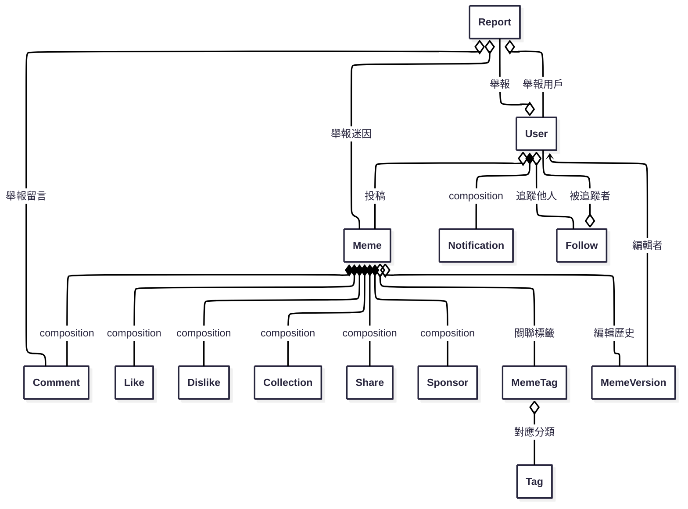

# memedex_backend

## 📊 API 路由功能對照表

### 🔐 認證權限說明

- 🔓 **公開** - 無需認證
- 🔑 **用戶** - 需要登入認證 (`token` + `isUser`)
- 👑 **管理員** - 需要管理員權限 (`token` + `isAdmin`)
- 🛡️ **經理** - 需要經理權限 (`token` + `isManager`)

---

### 👤 用戶管理 (`/users`)

| 方法   | 端點         | 功能         | 權限 | 統計維護    |
| ------ | ------------ | ------------ | ---- | ----------- |
| POST   | `/users`     | 用戶註冊     | 🔓   | -           |
| GET    | `/users`     | 獲取所有用戶 | 🛡️   | -           |
| GET    | `/users/me`  | 獲取個人資訊 | 🔑   | -           |
| PUT    | `/users/me`  | 更新個人資訊 | 🔑   | -           |
| DELETE | `/users/me`  | 刪除個人帳號 | 🔑   | ✅ 所有統計 |
| GET    | `/users/:id` | 獲取指定用戶 | 🔓   | -           |
| PUT    | `/users/:id` | 更新指定用戶 | 🛡️   | -           |
| DELETE | `/users/:id` | 刪除指定用戶 | 🛡️   | ✅ 所有統計 |

#### 認證相關

| 方法 | 端點                    | 功能         | 權限 |
| ---- | ----------------------- | ------------ | ---- |
| POST | `/users/login`          | 本地登入     | 🔓   |
| POST | `/users/logout`         | 登出         | 🔑   |
| POST | `/users/refresh`        | 刷新 Token   | 🔑   |
| POST | `/users/bind/:provider` | 綁定社群帳號 | 🔑   |

#### OAuth 社群登入

| 方法 | 端點                   | 功能           |
| ---- | ---------------------- | -------------- |
| GET  | `/users/auth/google`   | Google OAuth   |
| GET  | `/users/auth/facebook` | Facebook OAuth |
| GET  | `/users/auth/discord`  | Discord OAuth  |
| GET  | `/users/auth/twitter`  | Twitter OAuth  |

---

### 🎭 迷因管理 (`/memes`)

| 方法   | 端點                        | 功能         | 權限 | 統計維護                |
| ------ | --------------------------- | ------------ | ---- | ----------------------- |
| POST   | `/memes`                    | 創建迷因     | 🔑   | ✅ 作者 `meme_count +1` |
| GET    | `/memes`                    | 獲取迷因列表 | 🔓   | -                       |
| GET    | `/memes/search-suggestions` | 搜尋建議     | 🔓   | -                       |
| GET    | `/memes/by-tags`            | 標籤篩選     | 🔓   | -                       |
| GET    | `/memes/:id`                | 獲取單一迷因 | 🔓   | -                       |
| PUT    | `/memes/:id`                | 更新迷因     | 🔑   | -                       |
| DELETE | `/memes/:id`                | 刪除迷因     | 🔑   | ✅ 作者 `meme_count -1` |

#### 協作功能

| 方法   | 端點                                       | 功能         | 權限 |
| ------ | ------------------------------------------ | ------------ | ---- |
| POST   | `/memes/:id/editors`                       | 新增協作者   | 🔑   |
| DELETE | `/memes/:id/editors`                       | 移除協作者   | 🔑   |
| POST   | `/memes/:id/proposals`                     | 提交修改提案 | 🔑   |
| GET    | `/memes/:id/proposals`                     | 查看提案列表 | 🔑   |
| POST   | `/memes/:id/proposals/:proposalId/approve` | 審核通過     | 🔑   |
| POST   | `/memes/:id/proposals/:proposalId/reject`  | 駁回提案     | 🔑   |

---

### 💝 互動功能

#### 👍 按讚系統 (`/likes`)

| 方法   | 端點            | 功能       | 權限 | 統計維護                          |
| ------ | --------------- | ---------- | ---- | --------------------------------- |
| POST   | `/likes`        | 按讚       | 🔑   | ✅ 作者 `total_likes_received +1` |
| DELETE | `/likes`        | 取消讚     | 🔑   | ✅ 作者 `total_likes_received -1` |
| GET    | `/likes`        | 查詢讚數   | 🔓   | -                                 |
| POST   | `/likes/toggle` | 切換讚狀態 | 🔑   | ✅ 智能維護                       |

#### 👎 按噓系統 (`/dislikes`)

| 方法   | 端點               | 功能       | 權限 | 統計維護                |
| ------ | ------------------ | ---------- | ---- | ----------------------- |
| POST   | `/dislikes`        | 按噓       | 🔑   | -                       |
| DELETE | `/dislikes`        | 取消噓     | 🔑   | -                       |
| GET    | `/dislikes`        | 查詢噓數   | 🔓   | -                       |
| POST   | `/dislikes/toggle` | 切換噓狀態 | 🔑   | ✅ 自動移除讚並維護統計 |

#### ⭐ 收藏系統 (`/collections`)

| 方法   | 端點                  | 功能         | 權限 | 統計維護                      |
| ------ | --------------------- | ------------ | ---- | ----------------------------- |
| POST   | `/collections`        | 收藏         | 🔑   | ✅ 用戶 `collection_count +1` |
| DELETE | `/collections`        | 取消收藏     | 🔑   | ✅ 用戶 `collection_count -1` |
| GET    | `/collections`        | 查詢收藏     | 🔓   | -                             |
| POST   | `/collections/toggle` | 切換收藏狀態 | 🔑   | ✅ 智能維護                   |

#### 💬 評論系統 (`/comments`)

| 方法   | 端點            | 功能         | 權限 | 統計維護                   |
| ------ | --------------- | ------------ | ---- | -------------------------- |
| POST   | `/comments`     | 發表評論     | 🔑   | ✅ 用戶 `comment_count +1` |
| GET    | `/comments`     | 獲取評論     | 🔓   | -                          |
| GET    | `/comments/:id` | 獲取單一評論 | 🔓   | -                          |
| PUT    | `/comments/:id` | 更新評論     | 🔑   | -                          |
| DELETE | `/comments/:id` | 刪除評論     | 🔑   | ✅ 用戶 `comment_count -1` |

#### 📤 分享系統 (`/shares`)

| 方法   | 端點          | 功能         | 權限 | 統計維護                 |
| ------ | ------------- | ------------ | ---- | ------------------------ |
| POST   | `/shares`     | 創建分享     | 🔑   | ✅ 用戶 `share_count +1` |
| GET    | `/shares`     | 獲取分享記錄 | 🔑   | -                        |
| GET    | `/shares/:id` | 獲取單一分享 | 🔑   | -                        |
| PUT    | `/shares/:id` | 更新分享     | 🔑   | -                        |
| DELETE | `/shares/:id` | 刪除分享     | 🔑   | ✅ 用戶 `share_count -1` |

---

### 👥 追隨系統 (`/follows`)

| 方法 | 端點                          | 功能         | 權限 | 統計維護    |
| ---- | ----------------------------- | ------------ | ---- | ----------- |
| POST | `/follows/follow`             | 追隨用戶     | 🔑   | ✅ 雙方計數 |
| POST | `/follows/unfollow`           | 取消追隨     | 🔑   | ✅ 雙方計數 |
| POST | `/follows/toggle`             | 切換追隨狀態 | 🔑   | ✅ 智能維護 |
| GET  | `/follows/status/:user_id`    | 檢查追隨狀態 | 🔑   | -           |
| GET  | `/follows/following/:user_id` | 追隨列表     | 🔓   | -           |
| GET  | `/follows/followers/:user_id` | 粉絲列表     | 🔓   | -           |
| GET  | `/follows/stats/:user_id`     | 用戶統計     | 🔓   | -           |

---

### 🏷️ 標籤系統

#### 標籤管理 (`/tags`)

| 方法   | 端點            | 功能         | 權限 |
| ------ | --------------- | ------------ | ---- |
| POST   | `/tags`         | 創建標籤     | 🔑   |
| GET    | `/tags`         | 獲取標籤     | 🔓   |
| GET    | `/tags/popular` | 熱門標籤     | 🔓   |
| GET    | `/tags/:id`     | 獲取單一標籤 | 🔓   |
| PUT    | `/tags/:id`     | 更新標籤     | 🔑   |
| DELETE | `/tags/:id`     | 刪除標籤     | 🔑   |

#### 迷因標籤關聯 (`/meme-tags`)

| 方法   | 端點                           | 功能         | 權限 |
| ------ | ------------------------------ | ------------ | ---- |
| POST   | `/meme-tags`                   | 建立關聯     | 🔑   |
| POST   | `/meme-tags/:memeId/batch`     | 批量添加標籤 | 🔑   |
| GET    | `/meme-tags`                   | 獲取關聯     | 🔓   |
| GET    | `/meme-tags/meme/:memeId/tags` | 迷因的標籤   | 🔓   |
| GET    | `/meme-tags/tag/:tagId/memes`  | 標籤的迷因   | 🔓   |
| DELETE | `/meme-tags/:id`               | 刪除關聯     | 🔑   |
| DELETE | `/meme-tags/meme/:memeId/tags` | 清空迷因標籤 | 🔑   |

---

### 🔔 系統功能

#### 通知系統 (`/notifications`)

| 方法   | 端點                      | 功能         | 權限 |
| ------ | ------------------------- | ------------ | ---- |
| POST   | `/notifications`          | 創建通知     | 🛡️   |
| GET    | `/notifications`          | 獲取通知     | 🔑   |
| GET    | `/notifications/:id`      | 獲取單一通知 | 🔑   |
| PUT    | `/notifications/:id`      | 更新通知     | 🛡️   |
| DELETE | `/notifications/:id`      | 刪除通知     | 🛡️   |
| PATCH  | `/notifications/:id/read` | 標記已讀     | 🔑   |
| PATCH  | `/notifications/read/all` | 全部已讀     | 🔑   |

#### 檢舉系統 (`/reports`)

| 方法   | 端點           | 功能         | 權限 |
| ------ | -------------- | ------------ | ---- |
| POST   | `/reports`     | 提交檢舉     | 🔑   |
| GET    | `/reports`     | 獲取檢舉     | 🛡️   |
| GET    | `/reports/:id` | 獲取單一檢舉 | 🔑   |
| PUT    | `/reports/:id` | 更新檢舉     | 🔑   |
| DELETE | `/reports/:id` | 刪除檢舉     | 🔑   |

#### 公告系統 (`/announcements`)

| 方法   | 端點                 | 功能         | 權限 |
| ------ | -------------------- | ------------ | ---- |
| POST   | `/announcements`     | 創建公告     | 🔑   |
| GET    | `/announcements`     | 獲取公告     | 🔓   |
| GET    | `/announcements/:id` | 獲取單一公告 | 🔓   |
| PUT    | `/announcements/:id` | 更新公告     | 👑   |
| DELETE | `/announcements/:id` | 刪除公告     | 👑   |

---

### 💰 贊助系統 (`/sponsors`)

| 方法   | 端點            | 功能         | 權限 |
| ------ | --------------- | ------------ | ---- |
| POST   | `/sponsors`     | 創建贊助     | 🔑   |
| GET    | `/sponsors`     | 獲取贊助     | 🛡️   |
| GET    | `/sponsors/:id` | 獲取單一贊助 | 🔑   |
| PUT    | `/sponsors/:id` | 更新贊助     | 🔑   |
| DELETE | `/sponsors/:id` | 刪除贊助     | 🛡️   |

---

### 📋 版本管理 (`/meme-versions`)

| 方法   | 端點                 | 功能         | 權限 |
| ------ | -------------------- | ------------ | ---- |
| POST   | `/meme-versions`     | 創建版本     | 🔑   |
| GET    | `/meme-versions`     | 獲取版本     | 🔑   |
| GET    | `/meme-versions/:id` | 獲取單一版本 | 🔑   |
| PUT    | `/meme-versions/:id` | 更新版本     | 🔑   |
| DELETE | `/meme-versions/:id` | 刪除版本     | 🔑   |

---

### 📤 文件上傳 (`/api/upload`)

| 方法 | 端點                | 功能     | 權限 |
| ---- | ------------------- | -------- | ---- |
| POST | `/api/upload/image` | 上傳圖片 | 🔓   |

---

### 🛠️ 管理後台 (`/admin`)

| 方法 | 端點                               | 功能             | 權限 |
| ---- | ---------------------------------- | ---------------- | ---- |
| POST | `/admin/check-counts/:memeId`      | 檢查迷因統計     | 👑   |
| POST | `/admin/check-all-counts`          | 檢查所有迷因統計 | 👑   |
| GET  | `/admin/count-statistics`          | 獲取統計數據     | 👑   |
| POST | `/admin/check-user-counts/:userId` | 檢查用戶統計     | 👑   |
| POST | `/admin/check-all-user-counts`     | 檢查所有用戶統計 | 👑   |
| POST | `/admin/run-full-check`            | 手動完整檢查     | 👑   |
| GET  | `/admin/maintenance-status`        | 維護任務狀態     | 👑   |

---

### 📊 統計維護說明

#### 自動維護的統計字段

**用戶統計 (User Model)**

- `follower_count` - 粉絲數量
- `following_count` - 追隨數量
- `meme_count` - 發布迷因數量
- `collection_count` - 收藏數量
- `total_likes_received` - 獲得總讚數
- `comment_count` - 評論數量
- `share_count` - 分享數量

**迷因統計 (Meme Model)**

- `like_count` - 按讚數
- `dislike_count` - 按噓數
- `comment_count` - 評論數
- `collection_count` - 收藏數
- `share_count` - 分享數
- `views` - 瀏覽數

#### 統計維護觸發時機

✅ **即時更新** - 用戶操作時立即更新相關統計  
🔄 **定期檢查** - 每日自動檢查數據一致性  
🛠️ **手動修復** - 管理員可觸發完整檢查

---

## 資料表關聯圖（Mermaid）

以下為本專案主要資料表（Mongoose Model）之間的關聯設計圖，方便團隊與 AI 理解資料結構：



> 本圖僅為資料結構設計參考，實際關聯已於 `/models` 目錄下各 Mongoose schema 以 `ref` 屬性實作。

## API 設計注意事項

以下為本專案 CRUD API 目前設計時需注意的重點與最佳化建議：

1. **錯誤處理與回應格式**
   - 建議統一回應格式，例如 `{ success, data, error }`，方便前端統一處理。

2. **驗證與權限控管**
   - 目前 API 尚未加上登入驗證與權限控管，建議針對敏感操作加上 JWT 驗證與權限檢查。

3. **資料驗證與異常處理**
   - Model 層有基本 schema 驗證，controller 層可加強進階驗證與更友善的錯誤訊息。

## 追隨功能 API 文檔

### 基本追隨操作

#### POST /follows/toggle

切換追隨狀態（推薦使用此API）

```json
{
  "user_id": "用戶ID",
  "platform_detail": "web" // 可選
}
```

#### POST /follows/follow

追隨用戶

```json
{
  "user_id": "用戶ID",
  "platform_detail": "web" // 可選
}
```

#### POST /follows/unfollow

取消追隨用戶

```json
{
  "user_id": "用戶ID"
}
```

### 查詢功能

#### GET /follows/status/:user_id

檢查是否追隨某個用戶

```json
{
  "success": true,
  "data": {
    "is_following": true,
    "followed_at": "2024-01-01T00:00:00.000Z"
  }
}
```

#### GET /follows/following/:user_id?page=1&limit=20

獲取用戶的追隨列表（我追隨的人）

#### GET /follows/followers/:user_id?page=1&limit=20

獲取用戶的粉絲列表（追隨我的人）

#### GET /follows/stats/:user_id

獲取用戶統計資訊

```json
{
  "success": true,
  "data": {
    "follower_count": 150,
    "following_count": 89,
    "meme_count": 42,
    "collection_count": 78,
    "total_likes_received": 1250,
    "comment_count": 156,
    "share_count": 23
  }
}
```

### 權限說明

- 追隨/取消追隨操作需要登入驗證
- 查詢列表和統計資訊為公開API
- 檢查追隨狀態需要登入驗證

### 資料維護工具

新增用戶統計計數檢查功能：

```javascript
import { checkAndFixUserCounts } from './utils/checkCounts.js'

// 檢查所有用戶的統計計數
await checkAndFixUserCounts()

// 檢查特定用戶
await checkAndFixUserCounts('用戶ID')
```

## 用戶統計功能完整指南

### 統計字段說明

#### User Model 新增字段

- `follower_count` - 粉絲數量（追隨此用戶的人數）
- `following_count` - 追隨數量（此用戶追隨的人數）
- `meme_count` - 發布迷因數量
- `collection_count` - 收藏迷因數量
- `total_likes_received` - 獲得的總讚數
- `comment_count` - 發表評論數量
- `share_count` - 分享內容數量

### 自動統計維護

#### 即時統計更新

系統會在以下操作時自動更新統計：

1. **迷因操作**
   - 創建迷因：`meme_count +1`
   - 刪除迷因：`meme_count -1`

2. **追隨操作**
   - 追隨用戶：追隨者 `following_count +1`，被追隨者 `follower_count +1`
   - 取消追隨：追隨者 `following_count -1`，被追隨者 `follower_count -1`

3. **收藏操作**
   - 收藏迷因：`collection_count +1`
   - 取消收藏：`collection_count -1`

4. **按讚操作**
   - 按讚迷因：迷因作者 `total_likes_received +1`
   - 取消讚：迷因作者 `total_likes_received -1`
   - 註：噓功能會自動移除讚並更新統計

5. **評論操作**
   - 發表評論：`comment_count +1`
   - 刪除評論：`comment_count -1`

6. **分享操作**
   - 創建分享：`share_count +1`
   - 刪除分享：`share_count -1`

#### 定期維護任務

系統自動排程以下維護任務（僅在生產環境運行）：

- **每日凌晨2點**：檢查迷因統計計數
- **每日凌晨3點**：檢查用戶統計計數
- **每週日凌晨4點**：完整數據檢查

### 管理API

#### 用戶統計維護

```bash
# 檢查特定用戶統計
POST /admin/check-user-counts/:userId

# 檢查所有用戶統計
POST /admin/check-all-user-counts

# 手動觸發完整檢查
POST /admin/run-full-check

# 獲取維護任務狀態
GET /admin/maintenance-status
```

#### 統計API響應範例

```json
{
  "success": true,
  "data": {
    "total": 150,
    "fixed": 3,
    "errors": [],
    "details": [
      {
        "user_id": "507f1f77bcf86cd799439011",
        "username": "testuser",
        "fixed": true,
        "changes": {
          "follower_count": { "from": 10, "to": 12 },
          "meme_count": { "from": 5, "to": 6 }
        }
      }
    ]
  },
  "message": "已完成用戶統計檢查"
}
```

### 開發使用指南

#### 手動統計檢查

```javascript
import { checkAndFixUserCounts } from './utils/checkCounts.js'
import maintenanceScheduler from './utils/maintenance.js'

// 檢查特定用戶
const userResult = await checkAndFixUserCounts('用戶ID')

// 檢查所有用戶
const allUsersResult = await checkAndFixUserCounts()

// 手動觸發完整檢查
const fullCheckResult = await maintenanceScheduler.runFullCheck()
```

#### 在開發環境啟用維護任務

```javascript
// 手動啟動維護任務（開發環境預設關閉）
maintenanceScheduler.startAllTasks()

// 停止維護任務
maintenanceScheduler.stopAllTasks()

// 檢查任務狀態
const status = maintenanceScheduler.getTasksStatus()
```

### 數據一致性保證

1. **事務處理**：所有統計更新都使用MongoDB事務，確保原子性
2. **錯誤處理**：統計失敗不會影響主要業務邏輯
3. **定期檢查**：自動修復可能的數據不一致問題
4. **日誌記錄**：完整記錄所有維護操作和錯誤

### 性能優化

- 使用 `$inc` 操作符進行計數更新，避免讀取後更新的競態條件
- 批次處理大量數據檢查
- 異步處理維護任務，不阻塞主要業務流程
- 索引優化以提升統計查詢效率

### 監控和報警

建議在生產環境設置：

- 統計差異報警（當檢查發現大量不一致時）
- 維護任務失敗報警
- 統計API響應時間監控

4. **關聯查詢與巢狀資源**
   - 目前查詢多為單表，若需帶出關聯資料（如 user、meme），可於 controller 加上 `.populate()`。

5. **分頁與排序**
   - 目前查詢皆為全量查詢，建議加上分頁（如 `?page=1&limit=20`）與排序參數，提升效能。

6. **重複資料與唯一性**
   - Model 已有唯一性驗證，controller 層可加強錯誤處理，避免 race condition。

7. **刪除操作**
   - 目前皆為硬刪除（直接移除資料），如需軟刪除（標記 is_deleted），controller 需調整。

8. **安全性與防護**
   - 尚未加上 rate limit、防暴力破解等保護，建議部署時補強。

9. **API 路徑設計**
   - 路由設計已符合 RESTful 標準，若有巢狀需求可再擴充。

10. **其他細節**
    - 若有檔案上傳、第三方登入、通知推播、多語系、聚合查詢等需求，controller 需再擴充。

> 本節僅供開發與維護參考，實際需求請依專案進度與業務邏輯調整。

## 已知問題與優化計劃

### 標籤關聯批量創建優化

**狀態**：🔄 待優化  
**優先級**：中  
**影響範圍**：迷因投稿功能

#### 問題描述

目前迷因標籤關聯建立採用逐一創建方式，雖然功能正常但在標籤數量較多時存在性能問題。原本的批量創建API (`/meme-tags/batch`) 存在以下問題：

1. **參數格式兼容性**：多種格式兼容導致邏輯複雜
2. **事務處理**：批量操作的原子性處理不完善
3. **錯誤處理**：部分成功/部分失敗的情況處理不當
4. **驗證邏輯**：批量驗證的效率和正確性有待改善

#### 當前解決方案

**暫時採用單個創建方式**（已穩定運行）：

```javascript
// 前端：逐一創建標籤關聯
for (const tagId of tagIds) {
  await memeTagService.create({
    meme_id: meme._id,
    tag_id: tagId,
    lang: 'zh',
  })
}
```

#### 優化計劃

**階段1：維持現狀** ✅

- 保持單個創建邏輯確保系統穩定性
- 功能完全正常，用戶體驗無影響

**階段2：後端批量API重構** 🔄

- 重新設計 `batchCreateMemeTags` 控制器
- 簡化參數處理邏輯，統一接口格式
- 完善事務處理和錯誤處理機制
- 添加詳細的自動化測試

**階段3：前端批量功能啟用** 📋

- 實施降級策略：優先批量，失敗時自動降級到單個
- 添加性能監控和錯誤追蹤
- 漸進式升級部署

#### 預期效果

- **性能提升**：標籤關聯創建請求數量從 N 個減少到 1 個
- **用戶體驗**：投稿響應時間更快，特別是多標籤場景
- **系統穩定性**：降級機制確保系統可靠性

#### 技術細節

```javascript
// 目標：優化後的批量創建API
POST /meme-tags/batch
{
  "meme_id": "meme_id_here",
  "tag_ids": ["tag1", "tag2", "tag3"],
  "lang": "zh"
}

// 前端：智能降級策略
try {
  await memeTagService.batchCreate(batchData)
} catch (error) {
  // 自動降級到單個創建
  for (const tagId of tagIds) {
    await memeTagService.create(singleData)
  }
}
```

**記錄日期**：2025-07-25  
**負責人**：後端團隊  
**預計完成**：下一個開發週期

---

## 版本控制說明

目前下列五個模型已啟用 Mongoose 內建的 versionKey（預設 \_\_v 欄位），可用於偵測資料異動衝突：

- User
- Comment
- Announcement
- Meme
- Report

> versionKey 只會記錄當前版本號，無法保留完整歷史內容。

### 未來可擴充完整版本紀錄

若需追蹤每次異動的詳細內容，建議可考慮以下做法：

- 建立「歷史集合」：每次異動時將舊資料存入對應的 history collection（如 UserHistory、MemeHistory 等）。
- 文件內嵌版本陣列：於原始文件內新增 versions 欄位，保存歷史版本。
- 使用第三方套件：如 mongoose-version、mongoose-history 等。

請依實際需求選擇合適的版本控制策略。

## API 功能對照表

| 路徑                                     | 方法   | 功能描述                   |
| ---------------------------------------- | ------ | -------------------------- |
| /users                                   | POST   | 建立使用者                 |
| /users                                   | GET    | 取得所有使用者（管理員）   |
| /users/:id                               | GET    | 取得單一使用者（管理員）   |
| /users/:id                               | PUT    | 更新使用者（管理員）       |
| /users/:id                               | DELETE | 刪除使用者（管理員）       |
| /users/me                                | GET    | 取得自己資料               |
| /users/me                                | PUT    | 更新自己資料               |
| /users/me                                | DELETE | 刪除自己帳號               |
| /users/login                             | POST   | 登入                       |
| /users/logout                            | POST   | 登出                       |
| /users/refresh                           | POST   | 刷新Token                  |
| /users/bind/:provider                    | POST   | 綁定社群帳號               |
| /users/auth/google                       | GET    | Google OAuth 登入          |
| /users/auth/google/callback              | GET    | Google OAuth 回調          |
| /users/auth/facebook                     | GET    | Facebook OAuth 登入        |
| /users/auth/facebook/callback            | GET    | Facebook OAuth 回調        |
| /users/auth/discord                      | GET    | Discord OAuth 登入         |
| /users/auth/discord/callback             | GET    | Discord OAuth 回調         |
| /users/auth/twitter                      | GET    | Twitter OAuth 登入         |
| /users/auth/twitter/callback             | GET    | Twitter OAuth 回調         |
| /memes                                   | POST   | 建立迷因                   |
| /memes                                   | GET    | 取得所有迷因               |
| /memes/:id                               | GET    | 取得單一迷因               |
| /memes/:id                               | PUT    | 更新迷因                   |
| /memes/:id                               | DELETE | 刪除迷因                   |
| /memes/:id/editors                       | POST   | 新增協作者                 |
| /memes/:id/editors                       | DELETE | 移除協作者                 |
| /memes/:id/proposals                     | POST   | 提交迷因編輯提案           |
| /memes/:id/proposals                     | GET    | 查詢迷因所有提案（需權限） |
| /memes/:id/proposals/:proposalId/approve | POST   | 審核通過提案               |
| /memes/:id/proposals/:proposalId/reject  | POST   | 駁回提案                   |
| /announcements                           | POST   | 建立公告                   |
| /announcements                           | GET    | 取得所有公告               |
| /announcements/:id                       | GET    | 取得單一公告               |
| /announcements/:id                       | PUT    | 更新公告                   |
| /announcements/:id                       | DELETE | 刪除公告                   |
| /collections                             | POST   | 新增收藏                   |
| /collections                             | DELETE | 取消收藏                   |
| /collections                             | GET    | 查詢收藏                   |
| /collections/toggle                      | POST   | 收藏/取消收藏切換          |
| /comments                                | POST   | 建立留言                   |
| /comments                                | GET    | 取得所有留言               |
| /comments/:id                            | GET    | 取得單一留言               |
| /comments/:id                            | PUT    | 更新留言                   |
| /comments/:id                            | DELETE | 刪除留言                   |
| /likes                                   | POST   | 按讚                       |
| /likes                                   | DELETE | 取消讚                     |
| /likes                                   | GET    | 查詢讚數                   |
| /likes/toggle                            | POST   | 按讚/取消讚切換            |
| /dislikes                                | POST   | 按噓                       |
| /dislikes                                | DELETE | 取消噓                     |
| /dislikes                                | GET    | 查詢噓數                   |
| /dislikes/toggle                         | POST   | 按噓/取消噓切換            |
| /tags                                    | POST   | 建立標籤                   |
| /tags                                    | GET    | 取得所有標籤               |
| /tags/popular                            | GET    | 取得熱門標籤               |
| /tags/:id                                | GET    | 取得單一標籤               |
| /tags/:id                                | PUT    | 更新標籤                   |
| /tags/:id                                | DELETE | 刪除標籤                   |
| /memetags                                | POST   | 建立迷因標籤關聯           |
| /memetags/batch                          | POST   | 批量建立迷因標籤關聯       |
| /memetags                                | GET    | 取得所有迷因標籤關聯       |
| /memetags/:id                            | GET    | 取得單一迷因標籤關聯       |
| /memetags/meme/:memeId/tags              | GET    | 取得某迷因所有標籤         |
| /memetags/tag/:tagId/memes               | GET    | 取得某標籤所有迷因         |
| /memetags/:id                            | PUT    | 更新迷因標籤關聯           |
| /memetags/:id                            | DELETE | 刪除迷因標籤關聯           |
| /memetags/meme/:memeId/tags              | DELETE | 批量刪除迷因所有標籤       |
| /memeversions                            | POST   | 建立迷因版本               |
| /memeversions                            | GET    | 取得所有迷因版本           |
| /memeversions/:id                        | GET    | 取得單一迷因版本           |
| /memeversions/:id                        | PUT    | 更新迷因版本               |
| /memeversions/:id                        | DELETE | 刪除迷因版本               |
| /notifications                           | POST   | 建立通知（管理員）         |
| /notifications                           | GET    | 取得所有通知               |
| /notifications/:id                       | GET    | 取得單一通知               |
| /notifications/:id                       | PUT    | 更新通知（管理員）         |
| /notifications/:id                       | DELETE | 刪除通知（管理員）         |
| /notifications/:id/read                  | PATCH  | 標記單一通知為已讀         |
| /notifications/read/all                  | PATCH  | 批次標記全部通知為已讀     |
| /notifications/batch                     | DELETE | 批次刪除通知               |
| /reports                                 | POST   | 建立舉報                   |
| /reports                                 | GET    | 取得所有舉報（管理員）     |
| /reports/:id                             | GET    | 取得單一舉報（權限）       |
| /reports/:id                             | PUT    | 編輯舉報（權限）           |
| /reports/:id                             | DELETE | 刪除舉報（權限）           |
| /shares                                  | POST   | 建立分享                   |
| /shares                                  | GET    | 取得所有分享               |
| /shares/:id                              | GET    | 取得單一分享               |
| /shares/:id                              | PUT    | 更新分享                   |
| /shares/:id                              | DELETE | 刪除分享                   |
| /sponsors                                | POST   | 建立贊助                   |
| /sponsors                                | GET    | 取得所有贊助（管理員）     |
| /sponsors/:id                            | GET    | 取得單一贊助               |
| /sponsors/:id                            | PUT    | 更新贊助                   |
| /sponsors/:id                            | DELETE | 刪除贊助（管理員）         |

> 權限註記：如「管理員」、「需權限」等，詳見原始碼 middleware 設定。
