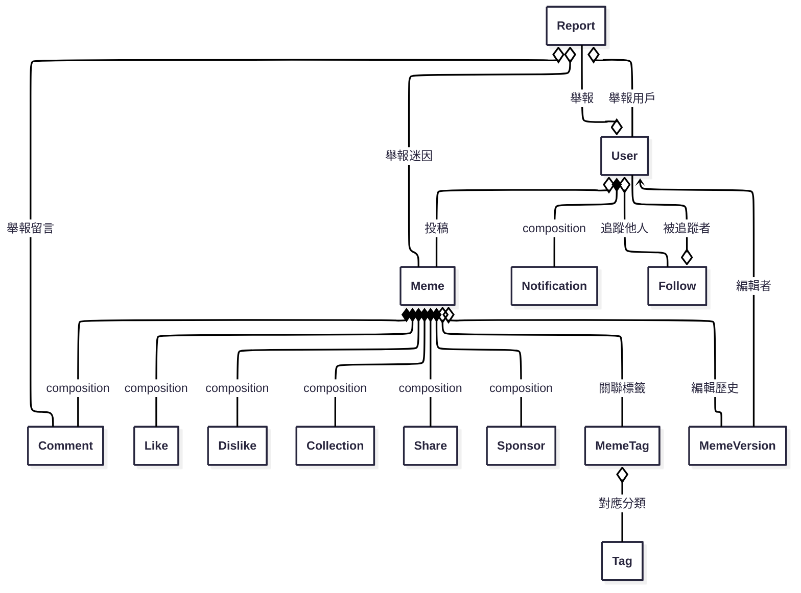

# memedex_backend

## 資料表關聯圖（Mermaid）

以下為本專案主要資料表（Mongoose Model）之間的關聯設計圖，方便團隊與 AI 理解資料結構：

> 本圖僅為資料結構設計參考，實際關聯已於 `/models` 目錄下各 Mongoose schema 以 `ref` 屬性實作。

## API 設計注意事項

以下為本專案 CRUD API 目前設計時需注意的重點與最佳化建議：

1. **錯誤處理與回應格式**
   - 建議統一回應格式，例如 `{ success, data, error }`，方便前端統一處理。

2. **驗證與權限控管**
   - 目前 API 尚未加上登入驗證與權限控管，建議針對敏感操作加上 JWT 驗證與權限檢查。

3. **資料驗證與異常處理**
   - Model 層有基本 schema 驗證，controller 層可加強進階驗證與更友善的錯誤訊息。

4. **關聯查詢與巢狀資源**
   - 目前查詢多為單表，若需帶出關聯資料（如 user、meme），可於 controller 加上 `.populate()`。

5. **分頁與排序**
   - 目前查詢皆為全量查詢，建議加上分頁（如 `?page=1&limit=20`）與排序參數，提升效能。

6. **重複資料與唯一性**
   - Model 已有唯一性驗證，controller 層可加強錯誤處理，避免 race condition。

7. **刪除操作**
   - 目前皆為硬刪除（直接移除資料），如需軟刪除（標記 is_deleted），controller 需調整。

8. **安全性與防護**
   - 尚未加上 rate limit、防暴力破解等保護，建議部署時補強。

9. **API 路徑設計**
   - 路由設計已符合 RESTful 標準，若有巢狀需求可再擴充。

10. **其他細節**
    - 若有檔案上傳、第三方登入、通知推播、多語系、聚合查詢等需求，controller 需再擴充。

> 本節僅供開發與維護參考，實際需求請依專案進度與業務邏輯調整。

## 版本控制說明

目前下列五個模型已啟用 Mongoose 內建的 versionKey（預設 \_\_v 欄位），可用於偵測資料異動衝突：

- User
- Comment
- Announcement
- Meme
- Report

> versionKey 只會記錄當前版本號，無法保留完整歷史內容。

### 未來可擴充完整版本紀錄

若需追蹤每次異動的詳細內容，建議可考慮以下做法：

- 建立「歷史集合」：每次異動時將舊資料存入對應的 history collection（如 UserHistory、MemeHistory 等）。
- 文件內嵌版本陣列：於原始文件內新增 versions 欄位，保存歷史版本。
- 使用第三方套件：如 mongoose-version、mongoose-history 等。

請依實際需求選擇合適的版本控制策略。

## API 功能對照表

| 路徑                                     | 方法   | 功能描述                   |
| ---------------------------------------- | ------ | -------------------------- |
| /users                                   | POST   | 建立使用者                 |
| /users                                   | GET    | 取得所有使用者（管理員）   |
| /users/:id                               | GET    | 取得單一使用者（管理員）   |
| /users/:id                               | PUT    | 更新使用者（管理員）       |
| /users/:id                               | DELETE | 刪除使用者（管理員）       |
| /users/me                                | GET    | 取得自己資料               |
| /users/me                                | PUT    | 更新自己資料               |
| /users/me                                | DELETE | 刪除自己帳號               |
| /users/login                             | POST   | 登入                       |
| /users/logout                            | POST   | 登出                       |
| /users/refresh                           | POST   | 刷新Token                  |
| /users/bind/:provider                    | POST   | 綁定社群帳號               |
| /users/auth/google                       | GET    | Google OAuth 登入          |
| /users/auth/google/callback              | GET    | Google OAuth 回調          |
| /users/auth/facebook                     | GET    | Facebook OAuth 登入        |
| /users/auth/facebook/callback            | GET    | Facebook OAuth 回調        |
| /users/auth/discord                      | GET    | Discord OAuth 登入         |
| /users/auth/discord/callback             | GET    | Discord OAuth 回調         |
| /users/auth/twitter                      | GET    | Twitter OAuth 登入         |
| /users/auth/twitter/callback             | GET    | Twitter OAuth 回調         |
| /memes                                   | POST   | 建立迷因                   |
| /memes                                   | GET    | 取得所有迷因               |
| /memes/:id                               | GET    | 取得單一迷因               |
| /memes/:id                               | PUT    | 更新迷因                   |
| /memes/:id                               | DELETE | 刪除迷因                   |
| /memes/:id/editors                       | POST   | 新增協作者                 |
| /memes/:id/editors                       | DELETE | 移除協作者                 |
| /memes/:id/proposals                     | POST   | 提交迷因編輯提案           |
| /memes/:id/proposals                     | GET    | 查詢迷因所有提案（需權限） |
| /memes/:id/proposals/:proposalId/approve | POST   | 審核通過提案               |
| /memes/:id/proposals/:proposalId/reject  | POST   | 駁回提案                   |
| /announcements                           | POST   | 建立公告                   |
| /announcements                           | GET    | 取得所有公告               |
| /announcements/:id                       | GET    | 取得單一公告               |
| /announcements/:id                       | PUT    | 更新公告                   |
| /announcements/:id                       | DELETE | 刪除公告                   |
| /collections                             | POST   | 新增收藏                   |
| /collections                             | DELETE | 取消收藏                   |
| /collections                             | GET    | 查詢收藏                   |
| /collections/toggle                      | POST   | 收藏/取消收藏切換          |
| /comments                                | POST   | 建立留言                   |
| /comments                                | GET    | 取得所有留言               |
| /comments/:id                            | GET    | 取得單一留言               |
| /comments/:id                            | PUT    | 更新留言                   |
| /comments/:id                            | DELETE | 刪除留言                   |
| /likes                                   | POST   | 按讚                       |
| /likes                                   | DELETE | 取消讚                     |
| /likes                                   | GET    | 查詢讚數                   |
| /likes/toggle                            | POST   | 按讚/取消讚切換            |
| /dislikes                                | POST   | 按噓                       |
| /dislikes                                | DELETE | 取消噓                     |
| /dislikes                                | GET    | 查詢噓數                   |
| /dislikes/toggle                         | POST   | 按噓/取消噓切換            |
| /tags                                    | POST   | 建立標籤                   |
| /tags                                    | GET    | 取得所有標籤               |
| /tags/popular                            | GET    | 取得熱門標籤               |
| /tags/:id                                | GET    | 取得單一標籤               |
| /tags/:id                                | PUT    | 更新標籤                   |
| /tags/:id                                | DELETE | 刪除標籤                   |
| /memetags                                | POST   | 建立迷因標籤關聯           |
| /memetags/batch                          | POST   | 批量建立迷因標籤關聯       |
| /memetags                                | GET    | 取得所有迷因標籤關聯       |
| /memetags/:id                            | GET    | 取得單一迷因標籤關聯       |
| /memetags/meme/:memeId/tags              | GET    | 取得某迷因所有標籤         |
| /memetags/tag/:tagId/memes               | GET    | 取得某標籤所有迷因         |
| /memetags/:id                            | PUT    | 更新迷因標籤關聯           |
| /memetags/:id                            | DELETE | 刪除迷因標籤關聯           |
| /memetags/meme/:memeId/tags              | DELETE | 批量刪除迷因所有標籤       |
| /memeversions                            | POST   | 建立迷因版本               |
| /memeversions                            | GET    | 取得所有迷因版本           |
| /memeversions/:id                        | GET    | 取得單一迷因版本           |
| /memeversions/:id                        | PUT    | 更新迷因版本               |
| /memeversions/:id                        | DELETE | 刪除迷因版本               |
| /notifications                           | POST   | 建立通知（管理員）         |
| /notifications                           | GET    | 取得所有通知               |
| /notifications/:id                       | GET    | 取得單一通知               |
| /notifications/:id                       | PUT    | 更新通知（管理員）         |
| /notifications/:id                       | DELETE | 刪除通知（管理員）         |
| /notifications/:id/read                  | PATCH  | 標記單一通知為已讀         |
| /notifications/read/all                  | PATCH  | 批次標記全部通知為已讀     |
| /notifications/batch                     | DELETE | 批次刪除通知               |
| /reports                                 | POST   | 建立舉報                   |
| /reports                                 | GET    | 取得所有舉報（管理員）     |
| /reports/:id                             | GET    | 取得單一舉報（權限）       |
| /reports/:id                             | PUT    | 編輯舉報（權限）           |
| /reports/:id                             | DELETE | 刪除舉報（權限）           |
| /shares                                  | POST   | 建立分享                   |
| /shares                                  | GET    | 取得所有分享               |
| /shares/:id                              | GET    | 取得單一分享               |
| /shares/:id                              | PUT    | 更新分享                   |
| /shares/:id                              | DELETE | 刪除分享                   |
| /sponsors                                | POST   | 建立贊助                   |
| /sponsors                                | GET    | 取得所有贊助（管理員）     |
| /sponsors/:id                            | GET    | 取得單一贊助               |
| /sponsors/:id                            | PUT    | 更新贊助                   |
| /sponsors/:id                            | DELETE | 刪除贊助（管理員）         |

> 權限註記：如「管理員」、「需權限」等，詳見原始碼 middleware 設定。
