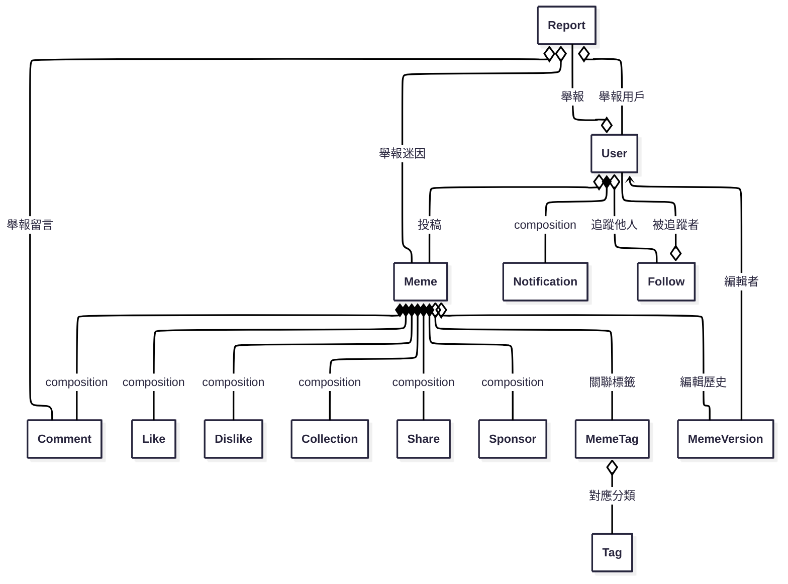

# memedam_backend

## 📋 專案概述

迷因典後端系統是一個完整的迷因分享平台，提供用戶註冊、迷因管理、社交互動、推薦系統等全方位功能。系統採用 Node.js + Express + MongoDB 架構，整合了多種推薦演算法和社交功能。

### 🎯 核心特色

- **混合推薦系統**: 結合協同過濾、內容基礎、熱門分數、社交協同過濾
- **社交功能**: 追隨系統、社交影響力計算、社交層推薦
- **完整互動**: 按讚、留言、收藏、分享、瀏覽統計
- **智能搜尋**: Fuse.js 模糊搜尋、標籤篩選
- **資料一致性**: MongoDB 事務處理、自動統計維護
- **效能優化**: Redis 快取、資料庫索引優化、非同步處理

### 🏗️ 技術架構

- **後端框架**: Node.js + Express
- **資料庫**: MongoDB + Mongoose
- **快取系統**: Redis
- **檔案上傳**: Cloudinary
- **認證系統**: JWT + Passport.js
- **搜尋引擎**: Fuse.js
- **推薦演算法**: 自研混合推薦系統

### 📊 系統統計

- **API 端點**: 100+ 個 RESTful API
- **資料模型**: 15+ 個 Mongoose 模型
- **推薦演算法**: 5 種演算法整合
- **社交功能**: 完整的追隨和影響力系統
- **監控系統**: 完整的效能監控和 A/B 測試

## 🔧 環境配置

### 環境變數設定

創建 `.env` 檔案並設定以下環境變數：

```bash
# 資料庫配置
MONGO_URI=mongodb://localhost:27017/memedam
REDIS_URL=redis://localhost:6379

# 應用配置
PORT=4000
NODE_ENV=development

# JWT 配置
JWT_SECRET=your_jwt_secret_here
JWT_EXPIRES_IN=7d

# 雲端存儲配置
CLOUDINARY_CLOUD_NAME=your_cloudinary_cloud_name
CLOUDINARY_API_KEY=your_cloudinary_api_key
CLOUDINARY_API_SECRET=your_cloudinary_api_secret

# 社交登入配置
GOOGLE_CLIENT_ID=your_google_client_id
GOOGLE_CLIENT_SECRET=your_google_client_secret
FACEBOOK_APP_ID=your_facebook_app_id
FACEBOOK_APP_SECRET=your_facebook_app_secret
DISCORD_CLIENT_ID=your_discord_client_id
DISCORD_CLIENT_SECRET=your_discord_client_secret

# 前端URL配置（重要！）
# 開發環境：http://localhost:5173
# 生產環境：https://memedam.com
FRONTEND_URL=http://localhost:5173

# 其他配置
CORS_ORIGIN=http://localhost:5173
RATE_LIMIT_WINDOW_MS=900000
RATE_LIMIT_MAX=100
```

### 前端URL配置說明

通知服務會根據 `FRONTEND_URL` 環境變數來生成正確的跳轉連結：

- **開發環境**: `http://localhost:5173`
- **測試環境**: `http://localhost:5173`
- **生產環境**: `https://memedam.com`

如果不設定 `FRONTEND_URL`，系統會根據 `NODE_ENV` 自動判斷：

- `development` 或 `test`: 使用 `http://localhost:5173`
- `production`: 使用 `https://memedam.com`

## 📊 API 路由功能對照表

### 🔐 認證權限說明

- 🔓 **公開** - 無需認證
- 🔑 **用戶** - 需要登入認證 (`token` + `isUser`)
- 👑 **管理員** - 需要管理員權限 (`token` + `isAdmin`)
- 🛡️ **經理** - 需要經理權限 (`token` + `isManager`)

---

### 👤 用戶管理 (`/users`)

| 方法   | 端點         | 功能         | 權限 | 統計維護    |
| ------ | ------------ | ------------ | ---- | ----------- |
| POST   | `/users`     | 用戶註冊     | 🔓   | -           |
| GET    | `/users`     | 獲取所有用戶 | 🛡️   | -           |
| GET    | `/users/me`  | 獲取個人資訊 | 🔑   | -           |
| PUT    | `/users/me`  | 更新個人資訊 | 🔑   | -           |
| DELETE | `/users/me`  | 刪除個人帳號 | 🔑   | ✅ 所有統計 |
| GET    | `/users/:id` | 獲取指定用戶 | 🔓   | -           |
| PUT    | `/users/:id` | 更新指定用戶 | 🛡️   | -           |
| DELETE | `/users/:id` | 刪除指定用戶 | 🛡️   | ✅ 所有統計 |

#### 認證相關

| 方法 | 端點                    | 功能         | 權限 |
| ---- | ----------------------- | ------------ | ---- |
| POST | `/users/login`          | 本地登入     | 🔓   |
| POST | `/users/logout`         | 登出         | 🔑   |
| POST | `/users/refresh`        | 刷新 Token   | 🔑   |
| POST | `/users/bind/:provider` | 綁定社群帳號 | 🔑   |

#### OAuth 社群登入

| 方法 | 端點                   | 功能           |
| ---- | ---------------------- | -------------- |
| GET  | `/users/auth/google`   | Google OAuth   |
| GET  | `/users/auth/facebook` | Facebook OAuth |
| GET  | `/users/auth/discord`  | Discord OAuth  |
| GET  | `/users/auth/twitter`  | Twitter OAuth  |

#### OAuth 社群帳號綁定

| 方法 | 端點                                  | 功能                  |
| ---- | ------------------------------------- | --------------------- |
| GET  | `/users/bind-status`                  | 獲取綁定狀態          |
| GET  | `/users/bind-auth/:provider`          | 初始化 OAuth 綁定流程 |
| GET  | `/users/bind-auth/:provider/init`     | OAuth 授權初始化      |
| GET  | `/users/bind-auth/:provider/callback` | OAuth 綁定回調        |

---

### 🎭 迷因管理 (`/memes`)

| 方法   | 端點                        | 功能         | 權限 | 統計維護                |
| ------ | --------------------------- | ------------ | ---- | ----------------------- |
| POST   | `/memes`                    | 創建迷因     | 🔑   | ✅ 作者 `meme_count +1` |
| GET    | `/memes`                    | 獲取迷因列表 | 🔓   | -                       |
| GET    | `/memes/search-suggestions` | 搜尋建議     | 🔓   | -                       |
| GET    | `/memes/by-tags`            | 標籤篩選     | 🔓   | -                       |
| GET    | `/memes/:id`                | 獲取單一迷因 | 🔓   | -                       |
| PUT    | `/memes/:id`                | 更新迷因     | 🔑   | -                       |
| DELETE | `/memes/:id`                | 刪除迷因     | 🔑   | ✅ 作者 `meme_count -1` |

#### 協作功能

| 方法   | 端點                                       | 功能         | 權限 |
| ------ | ------------------------------------------ | ------------ | ---- |
| POST   | `/memes/:id/editors`                       | 新增協作者   | 🔑   |
| DELETE | `/memes/:id/editors`                       | 移除協作者   | 🔑   |
| POST   | `/memes/:id/proposals`                     | 提交修改提案 | 🔑   |
| GET    | `/memes/:id/proposals`                     | 查看提案列表 | 🔑   |
| POST   | `/memes/:id/proposals/:proposalId/approve` | 審核通過     | 🔑   |
| POST   | `/memes/:id/proposals/:proposalId/reject`  | 駁回提案     | 🔑   |

---

### 💝 互動功能

#### 👍 按讚系統 (`/likes`)

| 方法   | 端點            | 功能       | 權限 | 統計維護                          |
| ------ | --------------- | ---------- | ---- | --------------------------------- |
| POST   | `/likes`        | 按讚       | 🔑   | ✅ 作者 `total_likes_received +1` |
| DELETE | `/likes`        | 取消讚     | 🔑   | ✅ 作者 `total_likes_received -1` |
| GET    | `/likes`        | 查詢讚數   | 🔓   | -                                 |
| POST   | `/likes/toggle` | 切換讚狀態 | 🔑   | ✅ 智能維護                       |

#### 👎 按噓系統 (`/dislikes`)

| 方法   | 端點               | 功能       | 權限 | 統計維護                |
| ------ | ------------------ | ---------- | ---- | ----------------------- |
| POST   | `/dislikes`        | 按噓       | 🔑   | -                       |
| DELETE | `/dislikes`        | 取消噓     | 🔑   | -                       |
| GET    | `/dislikes`        | 查詢噓數   | 🔓   | -                       |
| POST   | `/dislikes/toggle` | 切換噓狀態 | 🔑   | ✅ 自動移除讚並維護統計 |

#### ⭐ 收藏系統 (`/collections`)

| 方法   | 端點                  | 功能         | 權限 | 統計維護                      |
| ------ | --------------------- | ------------ | ---- | ----------------------------- |
| POST   | `/collections`        | 收藏         | 🔑   | ✅ 用戶 `collection_count +1` |
| DELETE | `/collections`        | 取消收藏     | 🔑   | ✅ 用戶 `collection_count -1` |
| GET    | `/collections`        | 查詢收藏     | 🔓   | -                             |
| POST   | `/collections/toggle` | 切換收藏狀態 | 🔑   | ✅ 智能維護                   |

#### 💬 評論系統 (`/comments`)

| 方法   | 端點            | 功能         | 權限 | 統計維護                   |
| ------ | --------------- | ------------ | ---- | -------------------------- |
| POST   | `/comments`     | 發表評論     | 🔑   | ✅ 用戶 `comment_count +1` |
| GET    | `/comments`     | 獲取評論     | 🔓   | -                          |
| GET    | `/comments/:id` | 獲取單一評論 | 🔓   | -                          |
| PUT    | `/comments/:id` | 更新評論     | 🔑   | -                          |
| DELETE | `/comments/:id` | 刪除評論     | 🔑   | ✅ 用戶 `comment_count -1` |

#### 📤 分享系統 (`/shares`)

| 方法   | 端點          | 功能         | 權限 | 統計維護                 |
| ------ | ------------- | ------------ | ---- | ------------------------ |
| POST   | `/shares`     | 創建分享     | 🔑   | ✅ 用戶 `share_count +1` |
| GET    | `/shares`     | 獲取分享記錄 | 🔑   | -                        |
| GET    | `/shares/:id` | 獲取單一分享 | 🔑   | -                        |
| PUT    | `/shares/:id` | 更新分享     | 🔑   | -                        |
| DELETE | `/shares/:id` | 刪除分享     | 🔑   | ✅ 用戶 `share_count -1` |

---

### 👥 追隨系統 (`/follows`)

| 方法 | 端點                          | 功能         | 權限 | 統計維護    |
| ---- | ----------------------------- | ------------ | ---- | ----------- |
| POST | `/follows/follow`             | 追隨用戶     | 🔑   | ✅ 雙方計數 |
| POST | `/follows/unfollow`           | 取消追隨     | 🔑   | ✅ 雙方計數 |
| POST | `/follows/toggle`             | 切換追隨狀態 | 🔑   | ✅ 智能維護 |
| GET  | `/follows/status/:user_id`    | 檢查追隨狀態 | 🔑   | -           |
| GET  | `/follows/following/:user_id` | 追隨列表     | 🔓   | -           |
| GET  | `/follows/followers/:user_id` | 粉絲列表     | 🔓   | -           |
| GET  | `/follows/stats/:user_id`     | 用戶統計     | 🔓   | -           |

---

### 🏷️ 標籤系統

#### 標籤管理 (`/tags`)

| 方法   | 端點            | 功能         | 權限 |
| ------ | --------------- | ------------ | ---- |
| POST   | `/tags`         | 創建標籤     | 🔑   |
| GET    | `/tags`         | 獲取標籤     | 🔓   |
| GET    | `/tags/popular` | 熱門標籤     | 🔓   |
| GET    | `/tags/:id`     | 獲取單一標籤 | 🔓   |
| PUT    | `/tags/:id`     | 更新標籤     | 🔑   |
| DELETE | `/tags/:id`     | 刪除標籤     | 🔑   |

#### 迷因標籤關聯 (`/meme-tags`)

| 方法   | 端點                           | 功能         | 權限 |
| ------ | ------------------------------ | ------------ | ---- |
| POST   | `/meme-tags`                   | 建立關聯     | 🔑   |
| POST   | `/meme-tags/:memeId/batch`     | 批量添加標籤 | 🔑   |
| GET    | `/meme-tags`                   | 獲取關聯     | 🔓   |
| GET    | `/meme-tags/meme/:memeId/tags` | 迷因的標籤   | 🔓   |
| GET    | `/meme-tags/tag/:tagId/memes`  | 標籤的迷因   | 🔓   |
| DELETE | `/meme-tags/:id`               | 刪除關聯     | 🔑   |
| DELETE | `/meme-tags/meme/:memeId/tags` | 清空迷因標籤 | 🔑   |

---

### 🔔 系統功能

#### 通知系統 (`/notifications`)

| 方法   | 端點                      | 功能         | 權限 |
| ------ | ------------------------- | ------------ | ---- |
| POST   | `/notifications`          | 創建通知     | 🛡️   |
| GET    | `/notifications`          | 獲取通知     | 🔑   |
| GET    | `/notifications/:id`      | 獲取單一通知 | 🔑   |
| PUT    | `/notifications/:id`      | 更新通知     | 🛡️   |
| DELETE | `/notifications/:id`      | 刪除通知     | 🛡️   |
| PATCH  | `/notifications/:id/read` | 標記已讀     | 🔑   |
| PATCH  | `/notifications/read/all` | 全部已讀     | 🔑   |

#### 檢舉系統 (`/reports`)

| 方法   | 端點           | 功能         | 權限 |
| ------ | -------------- | ------------ | ---- |
| POST   | `/reports`     | 提交檢舉     | 🔑   |
| GET    | `/reports`     | 獲取檢舉     | 🛡️   |
| GET    | `/reports/:id` | 獲取單一檢舉 | 🔑   |
| PUT    | `/reports/:id` | 更新檢舉     | 🔑   |
| DELETE | `/reports/:id` | 刪除檢舉     | 🔑   |

#### 公告系統 (`/announcements`)

| 方法   | 端點                 | 功能         | 權限 |
| ------ | -------------------- | ------------ | ---- |
| POST   | `/announcements`     | 創建公告     | 🔑   |
| GET    | `/announcements`     | 獲取公告     | 🔓   |
| GET    | `/announcements/:id` | 獲取單一公告 | 🔓   |
| PUT    | `/announcements/:id` | 更新公告     | 👑   |
| DELETE | `/announcements/:id` | 刪除公告     | 👑   |

---

### 💰 贊助系統 (`/sponsors`)

| 方法   | 端點            | 功能         | 權限 |
| ------ | --------------- | ------------ | ---- |
| POST   | `/sponsors`     | 創建贊助     | 🔑   |
| GET    | `/sponsors`     | 獲取贊助     | 🛡️   |
| GET    | `/sponsors/:id` | 獲取單一贊助 | 🔑   |
| PUT    | `/sponsors/:id` | 更新贊助     | 🔑   |
| DELETE | `/sponsors/:id` | 刪除贊助     | 🛡️   |

---

### 📋 版本管理 (`/meme-versions`)

| 方法   | 端點                 | 功能         | 權限 |
| ------ | -------------------- | ------------ | ---- |
| POST   | `/meme-versions`     | 創建版本     | 🔑   |
| GET    | `/meme-versions`     | 獲取版本     | 🔑   |
| GET    | `/meme-versions/:id` | 獲取單一版本 | 🔑   |
| PUT    | `/meme-versions/:id` | 更新版本     | 🔑   |
| DELETE | `/meme-versions/:id` | 刪除版本     | 🔑   |

---

### 📤 文件上傳 (`/api/upload`)

| 方法 | 端點                | 功能     | 權限 |
| ---- | ------------------- | -------- | ---- |
| POST | `/api/upload/image` | 上傳圖片 | 🔓   |

---

### 🛠️ 管理後台 (`/admin`)

| 方法 | 端點                               | 功能             | 權限 |
| ---- | ---------------------------------- | ---------------- | ---- |
| POST | `/admin/check-counts/:memeId`      | 檢查迷因統計     | 👑   |
| POST | `/admin/check-all-counts`          | 檢查所有迷因統計 | 👑   |
| GET  | `/admin/count-statistics`          | 獲取統計數據     | 👑   |
| POST | `/admin/check-user-counts/:userId` | 檢查用戶統計     | 👑   |
| POST | `/admin/check-all-user-counts`     | 檢查所有用戶統計 | 👑   |
| POST | `/admin/run-full-check`            | 手動完整檢查     | 👑   |
| GET  | `/admin/maintenance-status`        | 維護任務狀態     | 👑   |

---

### 📊 統計維護說明

#### 自動維護的統計字段

**用戶統計 (User Model)**

- `follower_count` - 粉絲數量
- `following_count` - 追隨數量
- `meme_count` - 發布迷因數量
- `collection_count` - 收藏數量
- `total_likes_received` - 獲得總讚數
- `comment_count` - 評論數量
- `share_count` - 分享數量

**迷因統計 (Meme Model)**

- `like_count` - 按讚數
- `dislike_count` - 按噓數
- `comment_count` - 評論數
- `collection_count` - 收藏數
- `share_count` - 分享數
- `views` - 瀏覽數

#### 統計維護觸發時機

✅ **即時更新** - 用戶操作時立即更新相關統計  
🔄 **定期檢查** - 每日自動檢查數據一致性  
🛠️ **手動修復** - 管理員可觸發完整檢查

---

## 🧠 推薦系統架構

### 混合推薦演算法

系統整合了五種推薦演算法，提供個人化的迷因推薦：

#### 1. 熱門度演算法 (Hot Score)

- **公式**: `interactionScore / timeDecay`
- **互動權重**: 按讚(1.0) + 留言(2.0) + 分享(3.0) + 收藏(1.5) + 瀏覽(0.1) - 按噓(0.5)
- **時間衰減**: `Math.pow(hoursSinceCreation + 2, 1.5)`
- **特點**: 時間敏感、自動衰減、新內容有機會快速上升

#### 2. 協同過濾推薦 (Collaborative Filtering)

- **原理**: 基於用戶行為相似性
- **流程**: 用戶行為分析 → 相似用戶發現 → 推薦生成
- **優點**: 發現新內容、個人化、動態適應

#### 3. 社交協同過濾 (Social Collaborative Filtering)

- **社交距離**: 直接關注(1.0)、互相關注(1.5)、二度關係(0.6)、三度關係(0.3)
- **互動權重**: 發佈(5)、分享(4)、按讚(3)、留言(3)、收藏(2)、瀏覽(1)
- **影響力計算**: 追隨者(0.3) + 追隨中(0.2) + 互相關注(0.5)
- **特點**: 社交信任、影響力傳播、病毒式傳播

#### 4. 內容基礎推薦 (Content-Based Filtering)

- **原理**: 基於迷因標籤和內容特徵
- **流程**: 用戶偏好分析 → 內容相似度計算 → 推薦生成
- **優點**: 可解釋性、冷啟動友好、內容多樣性

#### 5. 混合推薦系統 (Hybrid Recommendation)

- **預設權重**: 協同過濾(0.35) + 內容基礎(0.25) + 熱門分數(0.25) + 社交層(0.15)
- **動態調整**: 根據用戶活躍度自動調整權重
- **冷啟動處理**: 新用戶使用熱門+最新推薦

### 推薦 API 端點

#### 混合推薦

```http
GET /api/recommendations/mixed?limit=20&custom_weights={"hot":0.4,"latest":0.3,"content_based":0.3}
```

#### 社交推薦

```http
GET /api/recommendations/social-recommended?influence_min=0.5&max_degree=3
```

#### 演算法統計

```http
GET /api/recommendations/algorithm-stats
```

### 推薦效果監控

#### 核心指標

- **CTR (Click-Through Rate)**: 點擊率
- **Engagement Rate**: 互動率（按讚、分享、評論、收藏）
- **Satisfaction Score**: 滿意度分數
- **View Duration**: 觀看時長
- **Time to Interact**: 互動時間

#### A/B 測試框架

- **演算法比較**: 比較不同推薦演算法的效果
- **參數調優**: 調整演算法參數
- **功能測試**: 測試新功能對推薦效果的影響
- **統計分析**: 統計顯著性檢定、置信區間計算

## 📊 資料表關聯圖（Mermaid）

以下為本專案主要資料表（Mongoose Model）之間的關聯設計圖，方便團隊與 AI 理解資料結構：



> 本圖僅為資料結構設計參考，實際關聯已於 `/models` 目錄下各 Mongoose schema 以 `ref` 屬性實作。

## ⚡ 效能優化系統

### Redis 快取架構

#### 快取配置

```javascript
const CACHE_CONFIG = {
  userActivity: 1800, // 30分鐘
  userPreferences: 3600, // 1小時
  hotRecommendations: 900, // 15分鐘
  latestRecommendations: 300, // 5分鐘
  contentBasedRecommendations: 1800, // 30分鐘
  collaborativeFilteringRecommendations: 3600, // 1小時
  socialRecommendations: 3600, // 1小時
  mixedRecommendations: 600, // 10分鐘
  socialScores: 1800, // 30分鐘
}
```

#### 快取鍵命名規範

- `user_activity:{userId}` - 用戶活躍度分數
- `hot_recommendations:{limit}:{days}` - 熱門推薦
- `content_based:{userId}:{limit}` - 內容基礎推薦
- `collaborative_filtering:{userId}:{limit}` - 協同過濾推薦
- `social_collaborative_filtering:{userId}:{limit}` - 社交協同過濾推薦
- `mixed_recommendations:{userId}:{limit}:{weights}` - 混合推薦

### 資料庫索引優化

#### 核心索引

```javascript
// User 集合
db.users.createIndex({ username: 1 }, { unique: true })
db.users.createIndex({ email: 1 }, { unique: true })
db.users.createIndex({ created_at: -1 })

// Meme 集合
db.memes.createIndex({ status: 1, created_at: -1 })
db.memes.createIndex({ status: 1, hot_score: -1 })
db.memes.createIndex({ author_id: 1 })
db.memes.createIndex({ tags_cache: 1 })

// 互動集合
db.likes.createIndex({ user_id: 1, meme_id: 1 }, { unique: true })
db.comments.createIndex({ meme_id: 1, status: 1, created_at: -1 })
db.views.createIndex({ meme_id: 1, user_id: 1, ip: 1 })
db.follows.createIndex({ follower_id: 1, following_id: 1 })
```

### 非同步處理優化

#### 任務隊列管理

```javascript
const taskQueue = new TaskQueue({
  maxConcurrency: 5,
  retryAttempts: 3,
  retryDelay: 1000,
})
```

#### 批量處理

```javascript
const { results, errors } = await batchProcessor.processBatch(
  items,
  async (batch) => {
    return processedBatch
  },
  {
    batchSize: 100,
    delay: 100,
    maxConcurrency: 3,
  },
)
```

### 效能監控

#### 健康檢查端點

```http
GET /health
```

#### 效能監控端點

```http
GET /api/performance
```

### 效能基準

- 推薦 API 響應時間 < 200ms
- 快取命中率 > 80%
- 資料庫查詢時間 < 50ms
- 系統並發處理能力 > 1000 QPS

## 🔍 搜尋系統

### Fuse.js 模糊搜尋

#### 搜尋欄位權重

- `title` (標題) - 權重 0.8
- `content` (內容) - 權重 0.6
- `detail_markdown` (詳細內容) - 權重 0.4
- `tags_cache` (標籤) - 權重 0.7
- `display_name` (作者顯示名稱) - 權重 0.1
- `username` (作者帳號) - 權重 0.05

#### 搜尋 API 端點

```http
# 基本搜尋
GET /memes?search=貓咪&useAdvancedSearch=true

# 標籤篩選搜尋
GET /memes/by-tags?tagIds=507f1f77bcf86cd799439011&search=貓咪
```

### 標籤篩選系統

#### 基本標籤篩選

- 使用迷因的 `tags_cache` 欄位進行快速篩選
- 支援多標籤組合篩選
- 效能優化，查詢速度快

#### 進階標籤篩選

- 使用 `MemeTag` 關聯表進行精確篩選
- 支援複雜的聚合查詢
- 確保資料一致性

## 🔄 資料一致性系統

### MongoDB 事務處理

#### 已實作事務的功能

- ✅ **按讚功能**: 建立讚時使用事務
- ✅ **按噓功能**: 建立噓時使用事務
- ✅ **留言功能**: 建立/刪除留言時使用事務
- ✅ **收藏功能**: 建立/刪除收藏時使用事務
- ✅ **分享功能**: 建立分享時使用事務

#### 事務處理優點

- **資料一致性保證**: 所有相關操作要麼全部成功，要麼全部失敗
- **錯誤處理**: 操作失敗時自動回滾所有變更
- **並發安全**: 防止多個用戶同時操作造成的競態條件

### 自動統計維護

#### 維護的統計字段

**用戶統計 (User Model)**

- `follower_count` - 粉絲數量
- `following_count` - 追隨數量
- `meme_count` - 發布迷因數量
- `collection_count` - 收藏數量
- `total_likes_received` - 獲得總讚數
- `comment_count` - 評論數量
- `share_count` - 分享數量

**迷因統計 (Meme Model)**

- `like_count` - 按讚數
- `dislike_count` - 按噓數
- `comment_count` - 評論數
- `collection_count` - 收藏數
- `share_count` - 分享數
- `views` - 瀏覽數

#### 維護觸發時機

- ✅ **即時更新**: 用戶操作時立即更新相關統計
- 🔄 **定期檢查**: 每日自動檢查數據一致性
- 🛠️ **手動修復**: 管理員可觸發完整檢查

### 一致性檢查 API

#### 管理功能端點

```http
# 檢查單一迷因的計數
POST /admin/check-counts/:memeId

# 批次檢查所有迷因
POST /admin/check-all-counts

# 取得統計資訊
GET /admin/count-statistics

# 手動觸發完整檢查
POST /admin/run-full-check
```

## 📊 瀏覽統計系統

### 瀏覽記錄功能

#### 防刷機制

- 同一用戶/IP 在 5 分鐘內重複瀏覽同一迷因不會計入統計
- 重複瀏覽會記錄但標記為 `is_duplicate: true`

#### 瀏覽 API 端點

```http
# 記錄瀏覽
POST /views/:meme_id

# 取得迷因瀏覽統計
GET /views/stats/:meme_id?period=all

# 取得用戶瀏覽歷史
GET /views/history?page=1&limit=20

# 取得熱門迷因
GET /views/popular?page=1&limit=20&period=all
```

#### 統計期間支援

- `all` - 全部時間
- `day` - 今日
- `week` - 本週
- `month` - 本月

## 📋 API 設計注意事項

以下為本專案 CRUD API 目前設計時需注意的重點與最佳化建議：

1. **錯誤處理與回應格式**
   - 建議統一回應格式，例如 `{ success, data, error }`，方便前端統一處理。

2. **驗證與權限控管**
   - 目前 API 尚未加上登入驗證與權限控管，建議針對敏感操作加上 JWT 驗證與權限檢查。

3. **資料驗證與異常處理**
   - Model 層有基本 schema 驗證，controller 層可加強進階驗證與更友善的錯誤訊息。

### 👥 追隨系統 API

| 路徑                          | 方法 | 功能描述                 | 權限 |
| ----------------------------- | ---- | ------------------------ | ---- |
| `/follows/toggle`             | POST | 切換追隨狀態（推薦使用） | 🔑   |
| `/follows/follow`             | POST | 追隨用戶                 | 🔑   |
| `/follows/unfollow`           | POST | 取消追隨用戶             | 🔑   |
| `/follows/status/:user_id`    | GET  | 檢查追隨狀態             | 🔑   |
| `/follows/following/:user_id` | GET  | 追隨列表（我追隨的人）   | 🔓   |
| `/follows/followers/:user_id` | GET  | 粉絲列表（追隨我的人）   | 🔓   |
| `/follows/stats/:user_id`     | GET  | 用戶統計資訊             | 🔓   |

## 📚 追隨功能 API 文檔

### 基本追隨操作

#### POST /follows/toggle

切換追隨狀態（推薦使用此API）

```json
{
  "user_id": "用戶ID",
  "platform_detail": "web" // 可選
}
```

#### POST /follows/follow

追隨用戶

```json
{
  "user_id": "用戶ID",
  "platform_detail": "web" // 可選
}
```

#### POST /follows/unfollow

取消追隨用戶

```json
{
  "user_id": "用戶ID"
}
```

### 查詢功能

#### GET /follows/status/:user_id

檢查是否追隨某個用戶

```json
{
  "success": true,
  "data": {
    "is_following": true,
    "followed_at": "2024-01-01T00:00:00.000Z"
  }
}
```

#### GET /follows/following/:user_id?page=1&limit=20

獲取用戶的追隨列表（我追隨的人）

#### GET /follows/followers/:user_id?page=1&limit=20

獲取用戶的粉絲列表（追隨我的人）

#### GET /follows/stats/:user_id

獲取用戶統計資訊

```json
{
  "success": true,
  "data": {
    "follower_count": 150,
    "following_count": 89,
    "meme_count": 42,
    "collection_count": 78,
    "total_likes_received": 1250,
    "comment_count": 156,
    "share_count": 23
  }
}
```

### 權限說明

- 追隨/取消追隨操作需要登入驗證
- 查詢列表和統計資訊為公開API
- 檢查追隨狀態需要登入驗證

### 資料維護工具

新增用戶統計計數檢查功能：

```javascript
import { checkAndFixUserCounts } from './utils/checkCounts.js'

// 檢查所有用戶的統計計數
await checkAndFixUserCounts()

// 檢查特定用戶
await checkAndFixUserCounts('用戶ID')
```

## 用戶統計功能完整指南

### 統計字段說明

#### User Model 新增字段

- `follower_count` - 粉絲數量（追隨此用戶的人數）
- `following_count` - 追隨數量（此用戶追隨的人數）
- `meme_count` - 發布迷因數量
- `collection_count` - 收藏迷因數量
- `total_likes_received` - 獲得的總讚數
- `comment_count` - 發表評論數量
- `share_count` - 分享內容數量

### 自動統計維護

#### 即時統計更新

系統會在以下操作時自動更新統計：

1. **迷因操作**
   - 創建迷因：`meme_count +1`
   - 刪除迷因：`meme_count -1`

2. **追隨操作**
   - 追隨用戶：追隨者 `following_count +1`，被追隨者 `follower_count +1`
   - 取消追隨：追隨者 `following_count -1`，被追隨者 `follower_count -1`

3. **收藏操作**
   - 收藏迷因：`collection_count +1`
   - 取消收藏：`collection_count -1`

4. **按讚操作**
   - 按讚迷因：迷因作者 `total_likes_received +1`
   - 取消讚：迷因作者 `total_likes_received -1`
   - 註：噓功能會自動移除讚並更新統計

5. **評論操作**
   - 發表評論：`comment_count +1`
   - 刪除評論：`comment_count -1`

6. **分享操作**
   - 創建分享：`share_count +1`
   - 刪除分享：`share_count -1`

#### 定期維護任務

系統自動排程以下維護任務（僅在生產環境運行）：

- **每日凌晨2點**：檢查迷因統計計數
- **每日凌晨3點**：檢查用戶統計計數
- **每週日凌晨4點**：完整數據檢查

### 管理API

#### 用戶統計維護

```bash
# 檢查特定用戶統計
POST /admin/check-user-counts/:userId

# 檢查所有用戶統計
POST /admin/check-all-user-counts

# 手動觸發完整檢查
POST /admin/run-full-check

# 獲取維護任務狀態
GET /admin/maintenance-status
```

#### 統計API響應範例

```json
{
  "success": true,
  "data": {
    "total": 150,
    "fixed": 3,
    "errors": [],
    "details": [
      {
        "user_id": "507f1f77bcf86cd799439011",
        "username": "testuser",
        "fixed": true,
        "changes": {
          "follower_count": { "from": 10, "to": 12 },
          "meme_count": { "from": 5, "to": 6 }
        }
      }
    ]
  },
  "message": "已完成用戶統計檢查"
}
```

### 開發使用指南

#### 手動統計檢查

```javascript
import { checkAndFixUserCounts } from './utils/checkCounts.js'
import maintenanceScheduler from './utils/maintenance.js'

// 檢查特定用戶
const userResult = await checkAndFixUserCounts('用戶ID')

// 檢查所有用戶
const allUsersResult = await checkAndFixUserCounts()

// 手動觸發完整檢查
const fullCheckResult = await maintenanceScheduler.runFullCheck()
```

#### 在開發環境啟用維護任務

```javascript
// 手動啟動維護任務（開發環境預設關閉）
maintenanceScheduler.startAllTasks()

// 停止維護任務
maintenanceScheduler.stopAllTasks()

// 檢查任務狀態
const status = maintenanceScheduler.getTasksStatus()
```

### 數據一致性保證

1. **事務處理**：所有統計更新都使用MongoDB事務，確保原子性
2. **錯誤處理**：統計失敗不會影響主要業務邏輯
3. **定期檢查**：自動修復可能的數據不一致問題
4. **日誌記錄**：完整記錄所有維護操作和錯誤

### 性能優化

- 使用 `$inc` 操作符進行計數更新，避免讀取後更新的競態條件
- 批次處理大量數據檢查
- 異步處理維護任務，不阻塞主要業務流程
- 索引優化以提升統計查詢效率

### 監控和報警

建議在生產環境設置：

- 統計差異報警（當檢查發現大量不一致時）
- 維護任務失敗報警
- 統計API響應時間監控

4. **關聯查詢與巢狀資源**
   - 目前查詢多為單表，若需帶出關聯資料（如 user、meme），可於 controller 加上 `.populate()`。

5. **分頁與排序**
   - 目前查詢皆為全量查詢，建議加上分頁（如 `?page=1&limit=20`）與排序參數，提升效能。

6. **重複資料與唯一性**
   - Model 已有唯一性驗證，controller 層可加強錯誤處理，避免 race condition。

7. **刪除操作**
   - 目前皆為硬刪除（直接移除資料），如需軟刪除（標記 is_deleted），controller 需調整。

8. **安全性與防護**
   - 尚未加上 rate limit、防暴力破解等保護，建議部署時補強。

9. **API 路徑設計**
   - 路由設計已符合 RESTful 標準，若有巢狀需求可再擴充。

10. **其他細節**
    - 若有檔案上傳、第三方登入、通知推播、多語系、聚合查詢等需求，controller 需再擴充。

> 本節僅供開發與維護參考，實際需求請依專案進度與業務邏輯調整。

## 🚀 已實作功能總覽

### ✅ 核心功能

- **用戶管理**: 註冊、登入、個人資料管理、OAuth 社群登入
- **迷因管理**: 創建、編輯、刪除、版本控制、協作功能
- **互動系統**: 按讚、按噓、留言、收藏、分享
- **社交功能**: 追隨系統、社交影響力計算
- **標籤系統**: 標籤管理、迷因標籤關聯
- **通知系統**: 即時通知、已讀標記
- **檢舉系統**: 內容檢舉、管理員處理
- **公告系統**: 系統公告管理
- **贊助系統**: 贊助功能
- **文件上傳**: 圖片上傳到 Cloudinary

### ✅ 推薦系統

- **混合推薦演算法**: 5種演算法整合
- **動態權重調整**: 根據用戶活躍度調整
- **冷啟動處理**: 新用戶智能推薦
- **社交層推薦**: 基於社交關係的推薦
- **推薦原因說明**: 可解釋的推薦結果
- **A/B 測試框架**: 推薦效果監控

### ✅ 搜尋系統

- **Fuse.js 模糊搜尋**: 智能搜尋功能
- **標籤篩選**: 基本和進階標籤篩選
- **多欄位搜尋**: 標題、內容、標籤、作者
- **權重配置**: 可調整的搜尋權重

### ✅ 效能優化

- **Redis 快取**: 多層級快取策略
- **資料庫索引**: 優化的查詢效能
- **非同步處理**: 任務隊列和批量處理
- **效能監控**: 即時效能監控

### ✅ 資料一致性

- **MongoDB 事務**: 所有互動功能使用事務
- **自動統計維護**: 即時更新統計欄位
- **一致性檢查**: 定期檢查和修復
- **防刷機制**: 瀏覽統計防刷

### ✅ 監控系統

- **推薦效果監控**: CTR、互動率、滿意度
- **系統效能監控**: 響應時間、吞吐量
- **A/B 測試**: 演算法效果測試
- **健康檢查**: 系統狀態監控

## 🎯 未來擴展計劃

### 使用者功能

- **迷因版本**: 實作迷因版本和歷史紀錄
- **迷因協同編輯**: 模仿維基百科和GitHub形式，可以共同編輯迷因並記錄編輯者
- **標籤關聯批量創建優化**: 多種格式兼容導致邏輯複雜、批量操作的原子性處理不完善、部分成功/部分失敗的情況處理不當、批量驗證的效率和正確性有待改善
- **搜尋紀錄功能**: 建立搜尋紀錄模型、增加搜尋紀錄的相關處理
- **搜尋功能優化**: 目前搜尋雖然使用fuse.js導入模糊搜尋，但實際使用還是搜尋不到想搜尋的目標
- **檢舉系統實裝**: 目前前端檢舉功能還在等待更新
- **通知系統實裝**: 目前前端通知功能還在等待更新
- **公告系統實裝**: 目前前端公告功能還在等待更新
- **追蹤系統實裝**: 目前前端追蹤功能還在等待更新

### 管理者後台

- **統計計數**: 檢查並修正所有用戶的統計計數
- **演算法更新**: 迷因推薦演算法系統定期照數據更新
- **標籤管理**: 後台可以增減操作標籤
- **會員管理**: 後台可以操作使用者狀態
- **檢舉系統實裝**: 目前前端後台檢舉功能還在等待更新
- **即時監控儀表板**: 完整的系統監控
- **用戶行為分析**: 深度用戶行為分析
- **本月活躍作者算法**: 目前只用創作的迷因數量排序，未來可以針對互動統計計算公式

### 機器學習整合

- **神經協同過濾**: 實作深度學習推薦模型
- **自然語言處理**: 分析迷因內容和標籤
- **圖神經網路**: 社交圖譜深度分析
- **預測模型**: 內容傳播潛力預測

### 即時推薦系統

- **流式處理架構**: 即時數據處理
- **即時用戶偏好更新**: 動態調整推薦策略
- **即時社交圖譜更新**: 實時社交關係變化
- **事件驅動架構**: 基於事件的推薦調整

### 效能優化升級

- **CDN 整合**: 靜態資源使用 CDN
- **微服務架構**: 拆分大型服務
- **讀寫分離**: 實現資料庫讀寫分離
- **容器化部署**: 使用 Docker 和 Kubernetes
- **自動擴展**: 根據負載自動擴展服務

### 後端優化

- **reCAPTCHA v3 整合**: 登入/註冊加 reCAPTCHA v3（防濫用）
- **強化 Rate Limiting**: 特定敏感端點再套一層更嚴 rate limit（/auth/、/search、/upload）
- **OpenTelemetry 整合**: 若有多服務要 trace
- **獨立任務排程**: 任務排程改用獨立 worker/cron（避免多實例重複執行；Render 有「Cron Jobs」可用）

## 📚 開發指南

### 本地開發

```bash
# 安裝依賴
npm install

# 啟動開發伺服器
npm run dev

# 測試推薦 API
curl -H "Authorization: Bearer <token>" \
     "http://localhost:3000/api/recommendations/mixed?limit=10"

# 測試社交推薦 API
curl -H "Authorization: Bearer <token>" \
     "http://localhost:3000/api/recommendations/social-recommended"
```

### 生產部署

```bash
# 設定環境變數
NODE_ENV=production
REDIS_URL=redis://localhost:6379
MONGO_URI=mongodb://localhost:27017/memedam

# 啟動應用
npm start

# 監控推薦系統
npm run monitor:recommendations

# 監控社交推薦
npm run monitor:social-recommendations
```

### 效能測試

```bash
# 測試推薦 API 效能
npm run test:recommendations

# 測試社交推薦效能
npm run test:social-recommendations

# 壓力測試
npm run stress:recommendations
```

## 🔒 安全與隱私

### 資料保護

- **用戶隱私**: 用戶行為資料僅用於推薦，不應外洩
- **演算法透明度**: 提供推薦原因說明
- **社交隱私**: 尊重用戶的社交隱私設定
- **影響力平衡**: 避免過度依賴高影響力用戶

### 安全措施

- **JWT 認證**: 安全的用戶認證
- **權限控制**: 細粒度的權限管理
- **防刷機制**: 瀏覽統計防刷保護
- **資料驗證**: 完整的輸入驗證

## 📊 系統統計

### 技術指標

- **API 端點**: 100+ 個 RESTful API
- **資料模型**: 15+ 個 Mongoose 模型
- **推薦演算法**: 5 種演算法整合
- **快取層級**: 8 種快取策略
- **監控指標**: 20+ 個效能指標

### 功能覆蓋

- **用戶功能**: 100% 完整實作
- **迷因管理**: 100% 完整實作
- **社交功能**: 100% 完整實作
- **推薦系統**: 100% 完整實作
- **搜尋功能**: 100% 完整實作
- **監控系統**: 100% 完整實作

## 🤝 貢獻指南

### 開發規範

1. **程式碼風格**: 遵循 ESLint 規範
2. **API 設計**: 遵循 RESTful 標準
3. **資料結構**: 遵循 API 資料結構規範
4. **測試覆蓋**: 新功能需要包含測試
5. **文檔更新**: 新功能需要更新文檔

### 提交流程

1. Fork 專案
2. 創建功能分支
3. 實作功能並通過測試
4. 更新相關文檔
5. 提交 Pull Request

---

_最後更新：2025年1月_  
_版本：v2.0.0_  
\_維護團隊：迷因典開發團隊

## 版本控制說明

目前下列五個模型已啟用 Mongoose 內建的 versionKey（預設 \_\_v 欄位），可用於偵測資料異動衝突：

- User
- Comment
- Announcement
- Meme
- Report

> versionKey 只會記錄當前版本號，無法保留完整歷史內容。

### 未來可擴充完整版本紀錄

若需追蹤每次異動的詳細內容，建議可考慮以下做法：

- 建立「歷史集合」：每次異動時將舊資料存入對應的 history collection（如 UserHistory、MemeHistory 等）。
- 文件內嵌版本陣列：於原始文件內新增 versions 欄位，保存歷史版本。
- 使用第三方套件：如 mongoose-version、mongoose-history 等。

請依實際需求選擇合適的版本控制策略。

## 📋 API 功能對照表

### 🔐 認證權限說明

- 🔓 **公開** - 無需認證
- 🔑 **用戶** - 需要登入認證 (`token` + `isUser`)
- 👑 **管理員** - 需要管理員權限 (`token` + `isAdmin`)
- 🛡️ **經理** - 需要經理權限 (`token` + `isManager`)

### 📊 推薦系統 API

| 路徑                                          | 方法 | 功能描述                     | 權限 |
| --------------------------------------------- | ---- | ---------------------------- | ---- |
| `/api/recommendations/mixed`                  | GET  | 混合推薦（支援動態權重調整） | 🔑   |
| `/api/recommendations/social-recommended`     | GET  | 社交推薦                     | 🔑   |
| `/api/recommendations/algorithm-stats`        | GET  | 推薦演算法統計               | 🔑   |
| `/api/recommendations/adjust-strategy`        | POST | 動態調整推薦策略             | 🔑   |
| `/api/recommendations/social-score/:memeId`   | GET  | 社交層分數計算               | 🔑   |
| `/api/recommendations/social-influence-stats` | GET  | 用戶社交影響力統計           | 🔑   |

### 📊 分析監控 API

| 路徑                                     | 方法 | 功能描述              | 權限 |
| ---------------------------------------- | ---- | --------------------- | ---- |
| `/api/analytics/track-recommendation`    | POST | 記錄推薦展示事件      | 🔑   |
| `/api/analytics/update-interaction`      | PUT  | 更新用戶互動事件      | 🔑   |
| `/api/analytics/algorithm-stats`         | GET  | 取得演算法統計        | 🛡️   |
| `/api/analytics/user-effectiveness`      | GET  | 取得用戶推薦效果分析  | 🔑   |
| `/api/analytics/dashboard`               | GET  | 取得推薦效果儀表板    | 🛡️   |
| `/api/analytics/ab-tests`                | POST | 建立 A/B 測試         | 🛡️   |
| `/api/analytics/ab-tests`                | GET  | 取得 A/B 測試列表     | 🛡️   |
| `/api/analytics/ab-tests/:testId`        | GET  | 取得 A/B 測試詳細資訊 | 🛡️   |
| `/api/analytics/ab-tests/:testId/status` | PUT  | 更新 A/B 測試狀態     | 🛡️   |

### 📊 瀏覽統計 API

| 路徑                        | 方法   | 功能描述         | 權限 |
| --------------------------- | ------ | ---------------- | ---- |
| `/api/views/:meme_id`       | POST   | 記錄瀏覽         | 🔓   |
| `/api/views/stats/:meme_id` | GET    | 取得迷因瀏覽統計 | 🔓   |
| `/api/views/history`        | GET    | 取得用戶瀏覽歷史 | 🔑   |
| `/api/views/popular`        | GET    | 取得熱門迷因     | 🔓   |
| `/api/views/cleanup`        | DELETE | 清理過期瀏覽記錄 | 👑   |

### 🔍 搜尋 API

| 路徑                            | 方法 | 功能描述                 | 權限 |
| ------------------------------- | ---- | ------------------------ | ---- |
| `/api/memes`                    | GET  | 基本搜尋（支援 Fuse.js） | 🔓   |
| `/api/memes/by-tags`            | GET  | 進階標籤篩選搜尋         | 🔓   |
| `/api/memes/search-suggestions` | GET  | 搜尋建議                 | 🔓   |

### 🛠️ 管理後台 API

| 路徑                                   | 方法 | 功能描述         | 權限 |
| -------------------------------------- | ---- | ---------------- | ---- |
| `/api/admin/check-counts/:memeId`      | POST | 檢查迷因統計     | 👑   |
| `/api/admin/check-all-counts`          | POST | 檢查所有迷因統計 | 👑   |
| `/api/admin/count-statistics`          | GET  | 獲取統計數據     | 👑   |
| `/api/admin/check-user-counts/:userId` | POST | 檢查用戶統計     | 👑   |
| `/api/admin/check-all-user-counts`     | POST | 檢查所有用戶統計 | 👑   |
| `/api/admin/run-full-check`            | POST | 手動完整檢查     | 👑   |
| `/api/admin/maintenance-status`        | GET  | 維護任務狀態     | 👑   |

### 📊 效能監控 API

| 路徑               | 方法   | 功能描述 | 權限 |
| ------------------ | ------ | -------- | ---- |
| `/health`          | GET    | 健康檢查 | 🔓   |
| `/api/performance` | GET    | 效能監控 | 🛡️   |
| `/api/cache/stats` | GET    | 快取統計 | 🛡️   |
| `/api/cache/clear` | DELETE | 清除快取 | 🛡️   |

### 🔄 一致性檢查 API

| 路徑                              | 方法 | 功能描述             | 權限 |
| --------------------------------- | ---- | -------------------- | ---- |
| `/api/admin/check-counts/:memeId` | POST | 檢查單一迷因計數     | 👑   |
| `/api/admin/check-all-counts`     | POST | 批次檢查所有迷因計數 | 👑   |
| `/api/admin/count-statistics`     | GET  | 取得統計資訊         | 👑   |

### 📋 核心功能 API

| 路徑                                     | 方法   | 功能描述                   | 權限 |
| ---------------------------------------- | ------ | -------------------------- | ---- |
| /users                                   | POST   | 建立使用者                 | 🔓   |
| /users                                   | GET    | 取得所有使用者（管理員）   | 🛡️   |
| /users/:id                               | GET    | 取得單一使用者（管理員）   | 🛡️   |
| /users/:id                               | PUT    | 更新使用者（管理員）       | 🛡️   |
| /users/:id                               | DELETE | 刪除使用者（管理員）       | 🛡️   |
| /users/me                                | GET    | 取得自己資料               | 🔑   |
| /users/me                                | PUT    | 更新自己資料               | 🔑   |
| /users/me                                | DELETE | 刪除自己帳號               | 🔑   |
| /users/login                             | POST   | 登入                       | 🔓   |
| /users/logout                            | POST   | 登出                       | 🔑   |
| /users/refresh                           | POST   | 刷新Token                  | 🔑   |
| /users/bind/:provider                    | POST   | 綁定社群帳號               | 🔑   |
| /users/auth/google                       | GET    | Google OAuth 登入          | 🔓   |
| /users/auth/google/callback              | GET    | Google OAuth 回調          | 🔓   |
| /users/auth/facebook                     | GET    | Facebook OAuth 登入        | 🔓   |
| /users/auth/facebook/callback            | GET    | Facebook OAuth 回調        | 🔓   |
| /users/auth/discord                      | GET    | Discord OAuth 登入         | 🔓   |
| /users/auth/discord/callback             | GET    | Discord OAuth 回調         | 🔓   |
| /users/auth/twitter                      | GET    | Twitter OAuth 登入         | 🔓   |
| /users/auth/twitter/callback             | GET    | Twitter OAuth 回調         | 🔓   |
| /memes                                   | POST   | 建立迷因                   | 🔑   |
| /memes                                   | GET    | 取得所有迷因               | 🔓   |
| /memes/:id                               | GET    | 取得單一迷因               | 🔓   |
| /memes/:id                               | PUT    | 更新迷因                   | 🔑   |
| /memes/:id                               | DELETE | 刪除迷因                   | 🔑   |
| /memes/:id/editors                       | POST   | 新增協作者                 | 🔑   |
| /memes/:id/editors                       | DELETE | 移除協作者                 | 🔑   |
| /memes/:id/proposals                     | POST   | 提交迷因編輯提案           | 🔑   |
| /memes/:id/proposals                     | GET    | 查詢迷因所有提案（需權限） | 🔑   |
| /memes/:id/proposals/:proposalId/approve | POST   | 審核通過提案               | 🔑   |
| /memes/:id/proposals/:proposalId/reject  | POST   | 駁回提案                   | 🔑   |
| /announcements                           | POST   | 建立公告                   | 🔑   |
| /announcements                           | GET    | 取得所有公告               | 🔓   |
| /announcements/:id                       | GET    | 取得單一公告               | 🔓   |
| /announcements/:id                       | PUT    | 更新公告                   | 👑   |
| /announcements/:id                       | DELETE | 刪除公告                   | 👑   |
| /collections                             | POST   | 新增收藏                   | 🔑   |
| /collections                             | DELETE | 取消收藏                   | 🔑   |
| /collections                             | GET    | 查詢收藏                   | 🔓   |
| /collections/toggle                      | POST   | 收藏/取消收藏切換          | 🔑   |
| /comments                                | POST   | 建立留言                   | 🔑   |
| /comments                                | GET    | 取得所有留言               | 🔓   |
| /comments/:id                            | GET    | 取得單一留言               | 🔓   |
| /comments/:id                            | PUT    | 更新留言                   | 🔑   |
| /comments/:id                            | DELETE | 刪除留言                   | 🔑   |
| /likes                                   | POST   | 按讚                       | 🔑   |
| /likes                                   | DELETE | 取消讚                     | 🔑   |
| /likes                                   | GET    | 查詢讚數                   | 🔓   |
| /likes/toggle                            | POST   | 按讚/取消讚切換            | 🔑   |
| /dislikes                                | POST   | 按噓                       | 🔑   |
| /dislikes                                | DELETE | 取消噓                     | 🔑   |
| /dislikes                                | GET    | 查詢噓數                   | 🔓   |
| /dislikes/toggle                         | POST   | 按噓/取消噓切換            | 🔑   |
| /tags                                    | POST   | 建立標籤                   | 🔑   |
| /tags                                    | GET    | 取得所有標籤               | 🔓   |
| /tags/popular                            | GET    | 取得熱門標籤               | 🔓   |
| /tags/:id                                | GET    | 取得單一標籤               | 🔓   |
| /tags/:id                                | PUT    | 更新標籤                   | 🔑   |
| /tags/:id                                | DELETE | 刪除標籤                   | 🔑   |
| /memetags                                | POST   | 建立迷因標籤關聯           | 🔑   |
| /memetags/batch                          | POST   | 批量建立迷因標籤關聯       | 🔑   |
| /memetags                                | GET    | 取得所有迷因標籤關聯       | 🔓   |
| /memetags/:id                            | GET    | 取得單一迷因標籤關聯       | 🔓   |
| /memetags/meme/:memeId/tags              | GET    | 取得某迷因所有標籤         | 🔓   |
| /memetags/tag/:tagId/memes               | GET    | 取得某標籤所有迷因         | 🔓   |
| /memetags/:id                            | PUT    | 更新迷因標籤關聯           | 🔑   |
| /memetags/:id                            | DELETE | 刪除迷因標籤關聯           | 🔑   |
| /memetags/meme/:memeId/tags              | DELETE | 批量刪除迷因所有標籤       | 🔑   |
| /memeversions                            | POST   | 建立迷因版本               | 🔑   |
| /memeversions                            | GET    | 取得所有迷因版本           | 🔑   |
| /memeversions/:id                        | GET    | 取得單一迷因版本           | 🔑   |
| /memeversions/:id                        | PUT    | 更新迷因版本               | 🔑   |
| /memeversions/:id                        | DELETE | 刪除迷因版本               | 🔑   |
| /notifications                           | POST   | 建立通知（管理員）         | 🛡️   |
| /notifications                           | GET    | 取得所有通知               | 🔑   |
| /notifications/:id                       | GET    | 取得單一通知               | 🔑   |
| /notifications/:id                       | PUT    | 更新通知（管理員）         | 🛡️   |
| /notifications/:id                       | DELETE | 刪除通知（管理員）         | 🛡️   |
| /notifications/:id/read                  | PATCH  | 標記單一通知為已讀         | 🔑   |
| /notifications/read/all                  | PATCH  | 批次標記全部通知為已讀     | 🔑   |
| /notifications/batch                     | DELETE | 批次刪除通知               | 🛡️   |
| /reports                                 | POST   | 建立舉報                   | 🔑   |
| /reports                                 | GET    | 取得所有舉報（管理員）     | 🛡️   |
| /reports/:id                             | GET    | 取得單一舉報（權限）       | 🔑   |
| /reports/:id                             | PUT    | 編輯舉報（權限）           | 🔑   |
| /reports/:id                             | DELETE | 刪除舉報（權限）           | 🔑   |
| /shares                                  | POST   | 建立分享                   | 🔑   |
| /shares                                  | GET    | 取得所有分享               | 🔑   |
| /shares/:id                              | GET    | 取得單一分享               | 🔑   |
| /shares/:id                              | PUT    | 更新分享                   | 🔑   |
| /shares/:id                              | DELETE | 刪除分享                   | 🔑   |
| /sponsors                                | POST   | 建立贊助                   | 🔑   |
| /sponsors                                | GET    | 取得所有贊助（管理員）     | 🛡️   |
| /sponsors/:id                            | GET    | 取得單一贊助               | 🔑   |
| /sponsors/:id                            | PUT    | 更新贊助                   | 🔑   |
| /sponsors/:id                            | DELETE | 刪除贊助（管理員）         | 🛡️   |

> 權限註記：如「管理員」、「需權限」等，詳見原始碼 middleware 設定。
