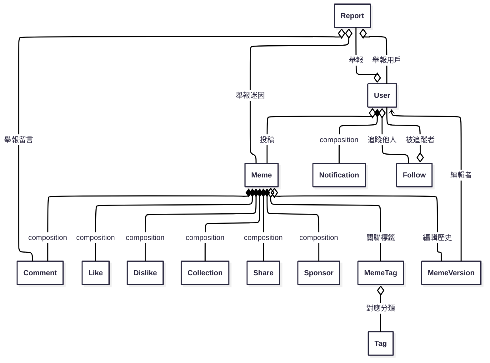

# memedex_backend

## 資料表關聯圖（Mermaid）

以下為本專案主要資料表（Mongoose Model）之間的關聯設計圖，方便團隊與 AI 理解資料結構：

> 本圖僅為資料結構設計參考，實際關聯已於 `/models` 目錄下各 Mongoose schema 以 `ref` 屬性實作。

## API 設計注意事項

以下為本專案 CRUD API 目前設計時需注意的重點與最佳化建議：

1. **錯誤處理與回應格式**
   - 建議統一回應格式，例如 `{ success, data, error }`，方便前端統一處理。

2. **驗證與權限控管**
   - 目前 API 尚未加上登入驗證與權限控管，建議針對敏感操作加上 JWT 驗證與權限檢查。

3. **資料驗證與異常處理**
   - Model 層有基本 schema 驗證，controller 層可加強進階驗證與更友善的錯誤訊息。

4. **關聯查詢與巢狀資源**
   - 目前查詢多為單表，若需帶出關聯資料（如 user、meme），可於 controller 加上 `.populate()`。

5. **分頁與排序**
   - 目前查詢皆為全量查詢，建議加上分頁（如 `?page=1&limit=20`）與排序參數，提升效能。

6. **重複資料與唯一性**
   - Model 已有唯一性驗證，controller 層可加強錯誤處理，避免 race condition。

7. **刪除操作**
   - 目前皆為硬刪除（直接移除資料），如需軟刪除（標記 is_deleted），controller 需調整。

8. **安全性與防護**
   - 尚未加上 rate limit、防暴力破解等保護，建議部署時補強。

9. **API 路徑設計**
   - 路由設計已符合 RESTful 標準，若有巢狀需求可再擴充。

10. **其他細節**
    - 若有檔案上傳、第三方登入、通知推播、多語系、聚合查詢等需求，controller 需再擴充。

> 本節僅供開發與維護參考，實際需求請依專案進度與業務邏輯調整。

## 版本控制說明

目前下列五個模型已啟用 Mongoose 內建的 versionKey（預設 \_\_v 欄位），可用於偵測資料異動衝突：

- User
- Comment
- Announcement
- Meme
- Report

> versionKey 只會記錄當前版本號，無法保留完整歷史內容。

### 未來可擴充完整版本紀錄

若需追蹤每次異動的詳細內容，建議可考慮以下做法：

- 建立「歷史集合」：每次異動時將舊資料存入對應的 history collection（如 UserHistory、MemeHistory 等）。
- 文件內嵌版本陣列：於原始文件內新增 versions 欄位，保存歷史版本。
- 使用第三方套件：如 mongoose-version、mongoose-history 等。

請依實際需求選擇合適的版本控制策略。
